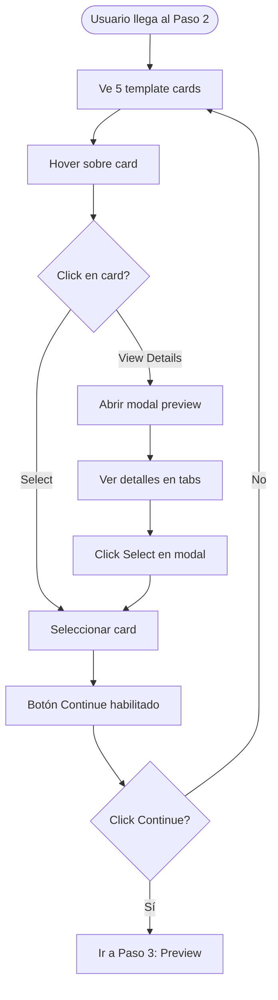

# Prompt Figma: Sección de Plantillas - Onboarding de Empresa

## Contexto

**Feature:** Sistema de Plantillas por Industria en el flujo de onboarding  
**Ubicación:** Paso 2 del flujo de onboarding multi-step  
**Objetivo:** Permitir que nuevas organizaciones seleccionen una plantilla pre-configurada basada en su industria para reducir fricción y mejorar time-to-value

---

## 1. CONTEXTO DEL FLUJO

### 1.1 Flujo Completo de Onboarding

El onboarding tiene 5 pasos:
1. **Paso 1:** Información Básica (nombre, país, moneda, email)
2. **Paso 2:** Selección de Industria (plantillas) ⭐ **ESTE PROMPT**
3. **Paso 3:** Preview de Plantilla (estructura sugerida)
4. **Paso 4:** Personalización (opcional - editar roles, servicios, costos)
5. **Paso 5:** Confirmación y aplicación

### 1.2 Objetivo del Paso 2

- Presentar 5 plantillas de industria de forma visual y atractiva
- Permitir selección intuitiva
- Mostrar información relevante de cada plantilla
- Facilitar decisión rápida sin abrumar

---

## 2. LAYOUT PRINCIPAL

### 2.1 Estructura de la Página

**Frame:** 1440px width (Desktop), responsive a 768px (Tablet) y 375px (Mobile)

**Layout:**
```
┌─────────────────────────────────────────────────┐
│ Header (Progress + Title)                       │
├─────────────────────────────────────────────────┤
│                                                  │
│  Subtitle/Description                           │
│                                                  │
│  ┌──────────┐  ┌──────────┐  ┌──────────┐     │
│  │ Template │  │ Template │  │ Template │     │
│  │  Card 1  │  │  Card 2  │  │  Card 3  │     │
│  └──────────┘  └──────────┘  └──────────┘     │
│                                                  │
│  ┌──────────┐  ┌──────────┐                     │
│  │ Template │  │ Template │                     │
│  │  Card 4  │  │  Card 5  │                     │
│  └──────────┘  └──────────┘                     │
│                                                  │
│  Footer (Navigation buttons)                    │
└─────────────────────────────────────────────────┘
```

### 2.2 Header Section

**Progress Indicator:**
- Componente de progreso multi-step
- 5 pasos totales
- Paso actual: 2 (resaltado)
- Pasos completados: 1 (checkmark)
- Pasos pendientes: 3, 4, 5 (gris)
- Altura: 48px
- Padding: 24px horizontal

**Title:**
- Text: "Choose Your Industry Template"
- Style: Text/Headline (32px/40px, Regular)
- Color: Grey 900
- Margin-top: 16px

**Description:**
- Text: "Select a template that matches your agency type. We'll pre-configure roles, services, and costs to get you started quickly."
- Style: Text/Body (16px/24px, Regular)
- Color: Grey 600
- Margin-top: 8px
- Max-width: 600px

### 2.3 Content Area

**Grid Layout:**
- Desktop (1440px): 3 columnas, gap 24px
- Tablet (768px): 2 columnas, gap 16px
- Mobile (375px): 1 columna, gap 16px

**Padding:**
- Desktop: 48px horizontal, 32px vertical
- Tablet: 32px horizontal, 24px vertical
- Mobile: 16px horizontal, 24px vertical

### 2.4 Footer Section

**Navigation:**
- Left: "Back" button (outlined)
- Right: "Continue" button (primary, disabled hasta selección)
- Padding: 24px horizontal
- Border-top: 1px Grey 200

---

## 3. TEMPLATE CARD COMPONENT

### 3.1 Especificación Base

**Dimensions:**
- Width: Auto (flexible según grid)
- Min height: 320px
- Aspect ratio: No fijo (contenido determina altura)

**Elevation:**
- Default: Elevation 2
- Hover: Elevation 8
- Selected: Elevation 4 + Border 2px Primary 500

**Border:**
- Default: 1px Grey 200
- Selected: 2px Primary 500
- Border radius: 12px

**Background:**
- Default: White
- Hover: White (solo cambia elevation)
- Selected: Primary 50 (muy sutil)

**Padding:**
- 24px en todos los lados

### 3.2 Estructura del Card

```
┌─────────────────────────────┐
│ [Icon]  [Title]             │
│         [Description]       │
│                             │
│ ┌─────────────────────────┐ │
│ │ Quick Stats             │ │
│ │ • X Roles               │ │
│ │ • Y Services            │ │
│ │ • Z Costs               │ │
│ └─────────────────────────┘ │
│                             │
│ [Badge: Recommended]       │
│ [Button: View Details]      │
└─────────────────────────────┘
```

### 3.3 Elementos del Card

#### 3.3.1 Header del Card

**Icon:**
- Tamaño: 56px x 56px
- Border radius: 12px
- Background: Color según industria (ver sección 4)
- Icon: Lucide icon apropiado, 32px, White
- Margin-bottom: 16px

**Title:**
- Text: Nombre de la plantilla (ej: "Agencia de Branding")
- Style: Text/Title (20px/28px, Medium)
- Color: Grey 900
- Margin-top: 16px (si icon está arriba)

**Description:**
- Text: Descripción breve (1-2 líneas)
- Style: Text/Body (14px/20px, Regular)
- Color: Grey 600
- Margin-top: 8px
- Max-height: 40px (2 líneas con ellipsis)

#### 3.3.2 Quick Stats Section

**Container:**
- Background: Grey 50
- Border radius: 8px
- Padding: 16px
- Margin-top: 16px

**Stats List:**
- Cada stat en una fila
- Icon: 16px, Grey 600
- Text: Text/Body (14px/20px)
- Color: Grey 700
- Gap: 8px entre items

**Stats a mostrar:**
- "X Team Roles" (con icono Users)
- "Y Services" (con icono Package)
- "Z Fixed Costs" (con icono DollarSign, opcional)

#### 3.3.3 Badge (Opcional)

**Recommended Badge:**
- Solo para plantilla más popular
- Position: Top-right del card
- Background: Warning 500
- Text: "Recommended"
- Text color: White
- Padding: 4px 8px
- Border radius: 12px
- Font: Text/Caption (12px/16px, Medium)

#### 3.3.4 Action Button

**"View Details" Button:**
- Variant: Outlined
- Size: Small
- Full width
- Margin-top: 16px
- Text: "View Details" o "Select" (si está seleccionado)

**Estados:**
- Default: "View Details"
- Selected: "Selected" (con check icon)
- Hover: Elevation +1

### 3.4 Estados del Card

**Default:**
- Border: 1px Grey 200
- Elevation: 2
- Background: White
- Cursor: pointer

**Hover:**
- Border: 1px Grey 300
- Elevation: 8
- Background: White
- Transition: 200ms ease-out

**Selected:**
- Border: 2px Primary 500
- Elevation: 4
- Background: Primary 50 (muy sutil, 5% opacity)
- Check icon visible en top-right corner

**Disabled:**
- Opacity: 0.5
- Cursor: not-allowed
- (No aplica en este contexto, pero para consistencia)

---

## 4. PLANTILLAS ESPECÍFICAS

### 4.1 Agencia de Branding

**Card Design:**
- Icon Background: Purple 500 (#9C27B0)
- Icon: Palette (Lucide)
- Title: "Agencia de Branding"
- Description: "Diseño gráfico, identidad visual, packaging y estrategia de marca"

**Quick Stats:**
- 5 Team Roles
- 4 Services
- 2 Fixed Costs

**Color Scheme:**
- Primary: Purple 500
- Accent: Purple 100 (para backgrounds sutiles)

**Visual Style:**
- Moderno, creativo
- Puede incluir elementos gráficos sutiles (opcional)

### 4.2 Desarrollo Web/Software

**Card Design:**
- Icon Background: Blue 500 (#2196F3)
- Icon: Code (Lucide)
- Title: "Desarrollo Web/Software"
- Description: "Desarrollo web, aplicaciones, APIs y mantenimiento de software"

**Quick Stats:**
- 6 Team Roles
- 5 Services
- 3 Fixed Costs

**Color Scheme:**
- Primary: Blue 500
- Accent: Blue 100

**Visual Style:**
- Técnico, profesional
- Elementos de código sutiles (opcional)

### 4.3 Producción Audiovisual

**Card Design:**
- Icon Background: Red 500 (#F44336)
- Icon: Video (Lucide)
- Title: "Producción Audiovisual"
- Description: "Video corporativo, post-producción, motion graphics y animación"

**Quick Stats:**
- 4 Team Roles
- 4 Services
- 3 Fixed Costs

**Color Scheme:**
- Primary: Red 500
- Accent: Red 100

**Visual Style:**
- Dinámico, visual
- Elementos de video sutiles (opcional)

### 4.4 Marketing Digital

**Card Design:**
- Icon Background: Green 500 (#4CAF50)
- Icon: Megaphone (Lucide)
- Title: "Marketing Digital"
- Description: "Redes sociales, SEO, publicidad digital y content marketing"

**Quick Stats:**
- 4 Team Roles
- 5 Services
- 2 Fixed Costs

**Color Scheme:**
- Primary: Green 500
- Accent: Green 100

**Visual Style:**
- Energético, moderno
- Elementos de crecimiento/gráficos (opcional)

### 4.5 Consultoría de Software

**Card Design:**
- Icon Background: Orange 500 (#FF9800)
- Icon: Briefcase (Lucide)
- Title: "Consultoría de Software"
- Description: "Auditoría técnica, arquitectura de sistemas y consultoría estratégica"

**Quick Stats:**
- 3 Team Roles
- 4 Services
- 2 Fixed Costs

**Color Scheme:**
- Primary: Orange 500
- Accent: Orange 100

**Visual Style:**
- Profesional, corporativo
- Elementos de estrategia (opcional)

---

## 5. INTERACCIONES Y ESTADOS

### 5.1 Selección de Plantilla

**Interacción:**
1. Usuario hace click en card
2. Card cambia a estado "Selected"
3. Otros cards vuelven a "Default"
4. Botón "Continue" se habilita
5. Feedback visual inmediato (200ms transition)

**Validación:**
- Al menos una plantilla debe estar seleccionada
- Solo una plantilla puede estar seleccionada a la vez
- Botón "Continue" deshabilitado si no hay selección

### 5.2 "View Details" Button

**Comportamiento:**
- Abre modal/dialog con preview completo
- No selecciona la plantilla (solo preview)
- Modal tiene botón "Select This Template" que selecciona y cierra

### 5.3 Estados Visuales

**Loading State (opcional):**
- Si las plantillas se cargan desde API
- Skeleton cards mientras carga
- 5 skeleton cards con estructura similar

**Empty State (no aplica):**
- Siempre hay 5 plantillas predefinidas

**Error State (opcional):**
- Si falla carga de plantillas
- Mensaje de error
- Botón "Retry"

---

## 6. MODAL DE PREVIEW (View Details)

### 6.1 Especificación del Modal

**Dimensions:**
- Width: 800px max (desktop)
- Max-height: 90vh
- Responsive: Full width en mobile

**Layout:**
```
┌─────────────────────────────────────┐
│ [Close]  Template Name              │
│          [Icon]                     │
├─────────────────────────────────────┤
│ [Tabs: Roles | Services | Costs]    │
├─────────────────────────────────────┤
│ Content Area (scrollable)            │
│                                     │
│ [Table/List of items]               │
│                                     │
├─────────────────────────────────────┤
│ [Cancel]  [Select This Template]     │
└─────────────────────────────────────┘
```

### 6.2 Header del Modal

**Close Button:**
- Icon button, top-right
- 40px x 40px
- Icon: X, 20px

**Template Info:**
- Icon: 48px, mismo color que card
- Title: Text/Headline
- Description: Text/Body, Grey 600

### 6.3 Tabs Navigation

**Tabs:**
- "Team Roles" (default)
- "Services"
- "Fixed Costs"

**Style:**
- Material Design tabs
- Active: Primary 500 underline
- Inactive: Grey 600 text
- Border-bottom: 1px Grey 200

### 6.4 Tab Content: Team Roles

**Table:**
- Columns: Role Name, Seniority, Salary Range, Billable Hours
- Rows: Cada rol sugerido
- Hover: Grey 50 background

**Example Data:**
```
Diseñador Gráfico Jr    | Junior    | $2,000-$3,000/mes | 160h/mes
Diseñador Gráfico Middle | Middle    | $3,500-$4,500/mes | 160h/mes
Diseñador Gráfico Senior | Senior    | $5,000-$7,000/mes | 160h/mes
Ejecutivo de Cuentas     | Middle    | $3,000-$4,000/mes | 160h/mes
Ilustrador               | Middle    | $3,000-$4,500/mes | 160h/mes
```

**Note:**
- Salarios ajustados según región seleccionada en Paso 1
- Mostrar multiplicador aplicado (ej: "x0.25 para Colombia")

### 6.5 Tab Content: Services

**Table:**
- Columns: Service Name, Description, Target Margin
- Rows: Cada servicio sugerido

**Example Data:**
```
Diseño de Identidad Visual | Brand identity design | 40%
Packaging Design           | Product packaging     | 35%
Brand Strategy             | Strategic consulting  | 45%
```

### 6.6 Tab Content: Fixed Costs

**List:**
- Cada costo en una card pequeña
- Name, Monthly Amount, Category

**Example Data:**
```
Adobe Creative Cloud  | $59.99/mes  | Software
Figma Team       | $12/user/mes    | Software
```

### 6.7 Footer del Modal

**Buttons:**
- "Cancel" (outlined, left)
- "Select This Template" (primary, right)

**Comportamiento:**
- "Select This Template": Selecciona plantilla, cierra modal, habilita "Continue"
- "Cancel": Solo cierra modal, no cambia selección

---

## 7. RESPONSIVE DESIGN

### 7.1 Desktop (1440px+)

**Grid:**
- 3 columnas
- Gap: 24px
- Cards: Mismo tamaño (flex)

**Modal:**
- Width: 800px
- Centered

### 7.2 Tablet (768px)

**Grid:**
- 2 columnas
- Gap: 16px

**Modal:**
- Width: 90vw
- Max-width: 800px

### 7.3 Mobile (375px)

**Grid:**
- 1 columna
- Gap: 16px
- Cards: Full width

**Header:**
- Progress indicator: Más compacto
- Title: Text/Title (20px) en lugar de Headline
- Description: Text/Body (14px)

**Cards:**
- Padding: 16px (reducido)
- Min-height: 280px (reducido)
- Stats: Más compactos

**Modal:**
- Full screen
- Tabs: Scrollable horizontal si necesario

---

## 8. ANIMACIONES Y TRANSICIONES

### 8.1 Card Interactions

**Hover:**
- Elevation: 2 → 8
- Duration: 200ms
- Easing: ease-out

**Selection:**
- Border: 1px Grey 200 → 2px Primary 500
- Background: White → Primary 50
- Check icon: Fade in
- Duration: 200ms
- Easing: ease-out

### 8.2 Modal

**Open:**
- Overlay: Fade in, 200ms
- Content: Scale in (0.95 → 1.0) + Fade in
- Duration: 200ms
- Easing: ease-out

**Close:**
- Reverse de open animation

### 8.3 Page Transition

**Al entrar al paso 2:**
- Cards: Fade in + Slide up (20px)
- Stagger: 100ms entre cada card
- Duration: 300ms

---

## 9. ACCESIBILIDAD

### 9.1 Keyboard Navigation

- Tab: Navegar entre cards
- Enter/Space: Seleccionar card
- Escape: Cerrar modal (si está abierto)
- Arrow keys: Navegar entre cards (opcional)

### 9.2 Screen Readers

- Cards: Role="button", aria-label con nombre y descripción
- Selected state: aria-selected="true"
- Modal: aria-labelledby con título
- Tabs: aria-controls y aria-selected

### 9.3 Focus States

- Cards: Ring 2px Primary 500, offset 2px
- Buttons: Ring 2px Primary 500
- Visible siempre (no solo en keyboard navigation)

---

## 10. COMPONENTES A CREAR

### 10.1 Template Card Component

**Variantes:**
- Default
- Hover
- Selected
- (Por cada una de las 5 plantillas)

**Properties:**
- Template type (Variant)
- State (Default, Hover, Selected)
- Recommended badge (Boolean)

### 10.2 Progress Indicator Component

**Variantes:**
- Step 1 (completado)
- Step 2 (actual)
- Step 3-5 (pendiente)

### 10.3 Preview Modal Component

**Variantes:**
- Por cada plantilla (5 variantes)
- Tabs (Roles, Services, Costs)

---

## 11. ESPECIFICACIONES TÉCNICAS

### 11.1 Naming Convention

**Frames:**
- `Onboarding/Step 2 - Templates/Desktop`
- `Onboarding/Step 2 - Templates/Tablet`
- `Onboarding/Step 2 - Templates/Mobile`

**Components:**
- `Component/Template Card/[Template Name]/[State]`
- Ejemplo: `Component/Template Card/Branding/Selected`

### 11.2 Auto Layout

**Template Card:**
- Padding: 24px
- Gap: 16px (vertical)
- Alignment: Top
- Constraints: Stretch horizontal

**Grid Container:**
- Auto Layout: Horizontal wrap
- Gap: 24px (desktop), 16px (tablet/mobile)
- Alignment: Start

### 11.3 Constraints

- Cards: Stretch horizontal, top aligned
- Header: Fixed top
- Footer: Fixed bottom
- Content: Scrollable si necesario

---

## 12. CONTENIDO DE EJEMPLO

### 12.1 Textos Reales

**Header:**
- Title: "Choose Your Industry Template"
- Description: "Select a template that matches your agency type. We'll pre-configure roles, services, and costs to get you started quickly. You can customize everything later."

**Cards (Branding example):**
- Title: "Agencia de Branding"
- Description: "Diseño gráfico, identidad visual, packaging y estrategia de marca"
- Stats:
  - "5 Team Roles"
  - "4 Services"
  - "2 Fixed Costs"

**Buttons:**
- "Back" (footer left)
- "Continue" (footer right)
- "View Details" (card button)
- "Select This Template" (modal button)

### 12.2 Placeholders

- Iconos: Usar Lucide icons
- Imágenes: No requeridas (solo iconos)
- Avatares: No aplica

---

## 13. CHECKLIST DE ENTREGABLES

### 13.1 Componentes Base
- [ ] Template Card component (con todas las variantes)
- [ ] Progress Indicator component
- [ ] Preview Modal component
- [ ] Navigation buttons

### 13.2 Páginas
- [ ] Desktop version (1440px)
- [ ] Tablet version (768px)
- [ ] Mobile version (375px)

### 13.3 Estados
- [ ] Default state
- [ ] Hover state
- [ ] Selected state
- [ ] Loading state (opcional)
- [ ] Modal open state

### 13.4 Plantillas
- [ ] Agencia de Branding (completa)
- [ ] Desarrollo Web/Software (completa)
- [ ] Producción Audiovisual (completa)
- [ ] Marketing Digital (completa)
- [ ] Consultoría de Software (completa)

### 13.5 Interacciones
- [ ] Card selection flow
- [ ] Modal open/close flow
- [ ] Tab navigation en modal
- [ ] Responsive breakpoints

### 13.6 Documentación
- [ ] Descripción en cada componente
- [ ] Notas de uso
- [ ] Especificaciones técnicas

---

## 14. NOTAS DE DISEÑO

### 14.1 Principios Visuales

1. **Claridad:** Cada plantilla debe ser fácilmente distinguible
2. **Consistencia:** Todos los cards siguen misma estructura
3. **Jerarquía:** Información más importante (title, icon) más prominente
4. **Feedback:** Estados claros (hover, selected)
5. **Minimalismo:** No sobrecargar con información

### 14.2 Colores por Industria

**Paleta de Iconos:**
- Branding: Purple (#9C27B0)
- Web Dev: Blue (#2196F3)
- Audiovisual: Red (#F44336)
- Marketing: Green (#4CAF50)
- Consultoría: Orange (#FF9800)

**Uso:**
- Icon background: Color sólido
- Accents sutiles: Color 100 (muy claro)
- Borders (si necesario): Color 200

### 14.3 Tipografía

**Títulos:**
- Card title: Text/Title (20px/28px, Medium)
- Page title: Text/Headline (32px/40px, Regular)

**Cuerpo:**
- Description: Text/Body (14px/20px o 16px/24px)
- Stats: Text/Body (14px/20px)

**Labels:**
- Button text: Text/Label (14px/20px, Medium)
- Badge text: Text/Caption (12px/16px, Medium)

---

## 15. FLUJO COMPLETO DE INTERACCIÓN

### 15.1 Flujo Principal



### 15.2 Estados del Flujo

**Estado Inicial:**
- 5 cards visibles
- Ninguna seleccionada
- Botón "Continue" deshabilitado
- Botón "Back" habilitado

**Estado Seleccionado:**
- 1 card con estado "Selected"
- Otros cards en "Default"
- Botón "Continue" habilitado
- Check icon visible en card seleccionado

**Estado Modal Abierto:**
- Overlay visible
- Modal centrado
- Tab "Team Roles" activo por defecto
- Botones de acción visibles

---

## 16. INTEGRACIÓN CON OTROS PASOS

### 16.1 Conexión con Paso 1

**Datos utilizados:**
- Country/Region: Para ajustar salarios en preview
- Currency: Para mostrar montos en preview
- Organization Name: Contexto (no visible en este paso)

### 16.2 Conexión con Paso 3

**Datos enviados:**
- Template ID seleccionado
- Industry type
- Datos del Paso 1 (region, currency)

**Paso 3 mostrará:**
- Preview completo de lo que se creará
- Con salarios ajustados por región
- Con moneda correcta

---

## 17. MEJORAS DE UX ADICIONALES

### 17.1 Recomendación Inteligente

**Badge "Recommended":**
- Mostrar en plantilla más popular
- O basado en datos del Paso 1 (si aplica)
- Color: Warning 500 (amarillo/naranja)
- Posición: Top-right del card

### 17.2 Búsqueda/Filtro (Opcional, Futuro)

**Si hay muchas plantillas:**
- Search bar arriba
- Filtrar por keywords
- No aplica ahora (solo 5 plantillas)

### 17.3 Preview Rápido

**Hover extendido:**
- Si usuario mantiene hover > 2s
- Mostrar tooltip con más info
- O preview mini (opcional)

---

## 18. ESPECIFICACIONES DE IMPLEMENTACIÓN

### 18.1 Componente React Esperado

```typescript
interface TemplateCardProps {
  template: IndustryTemplate;
  isSelected: boolean;
  onSelect: (templateId: string) => void;
  onViewDetails: (templateId: string) => void;
  isRecommended?: boolean;
}

interface IndustryTemplate {
  id: string;
  name: string;
  description: string;
  industryType: string;
  icon: string;
  color: string;
  stats: {
    roles: number;
    services: number;
    costs: number;
  };
}
```

### 18.2 Estados del Componente

```typescript
type CardState = 'default' | 'hover' | 'selected' | 'disabled';
```

### 18.3 Eventos

- `onClick`: Selecciona template
- `onViewDetails`: Abre modal
- `onMouseEnter`: Hover state
- `onMouseLeave`: Default state

---

## 19. VARIACIONES Y CASOS ESPECIALES

### 19.1 Usuario que ya tiene datos

**Si organización ya tiene roles/servicios:**
- Mostrar advertencia: "You already have data. Applying a template will add to your existing setup."
- Checkbox: "I understand this will add to my current data"
- Requerir confirmación

### 19.2 Skip Template (Opcional)

**Botón "Skip":**
- Text: "Start from scratch"
- Variant: Text button
- Posición: Debajo de cards o en footer
- Comportamiento: Salta a Paso 4 (personalización vacía)

---

## 20. VALIDACIONES Y ERRORES

### 20.1 Validaciones

- Al menos una plantilla debe estar seleccionada para continuar
- Si no hay selección, mostrar hint: "Please select a template to continue"

### 20.2 Estados de Error

**Error al cargar plantillas:**
- Mensaje: "Unable to load templates. Please try again."
- Botón "Retry"
- Icon: AlertCircle

**Error al aplicar plantilla (Paso 5):**
- Mostrar en Paso 5, no en Paso 2
- Pero diseño debe considerar este flujo

---

## 21. TESTING Y VALIDACIÓN

### 21.1 Casos de Prueba Visual

1. **Selección básica:**
   - Click en card → Debe seleccionarse
   - Otros cards → Deben deseleccionarse
   - Botón Continue → Debe habilitarse

2. **Modal:**
   - Click "View Details" → Modal abre
   - Navegar tabs → Contenido cambia
   - Click "Select" → Card se selecciona, modal cierra

3. **Responsive:**
   - Desktop: 3 columnas
   - Tablet: 2 columnas
   - Mobile: 1 columna

4. **Accesibilidad:**
   - Navegación por teclado funciona
   - Screen reader anuncia estados
   - Focus visible siempre

---

## 22. RECURSOS ADICIONALES

### 22.1 Iconos Lucide

**Por Plantilla:**
- Branding: `Palette`
- Web Dev: `Code`
- Audiovisual: `Video`
- Marketing: `Megaphone`
- Consultoría: `Briefcase`

**Otros:**
- Users (para roles)
- Package (para servicios)
- DollarSign (para costos)
- Check (para seleccionado)
- X (para cerrar modal)

### 22.2 Colores Material Design

Usar colores estándar de Material Design para cada industria (ya especificados en sección 4).

---

## 23. ENTREGABLES FINALES

### 23.1 Frames Principales

1. **Desktop - Step 2 Default**
   - 5 cards en grid 3 columnas
   - Ninguna seleccionada
   - Botón Continue deshabilitado

2. **Desktop - Step 2 Selected**
   - 1 card seleccionado
   - Botón Continue habilitado

3. **Desktop - Modal Open**
   - Modal con preview
   - Tab "Team Roles" activo

4. **Tablet - Step 2**
   - Grid 2 columnas
   - Adaptaciones responsive

5. **Mobile - Step 2**
   - Grid 1 columna
   - Cards full width
   - Modal full screen

### 23.2 Componentes Reutilizables

- Template Card (con todas las variantes)
- Progress Indicator
- Preview Modal
- Tab Navigation
- Stats List

### 23.3 Prototipos

- Conectar frames para flujo interactivo
- Transiciones entre estados
- Modal open/close
- Tab navigation

---

**Objetivo Final:** Crear una experiencia visual atractiva e intuitiva que permita a los usuarios seleccionar rápidamente la plantilla que mejor se adapte a su industria, reduciendo fricción en el onboarding y mejorando time-to-value.

---

**Fecha de creación:** Diciembre 2025  
**Versión:** 1.0  
**Basado en:** PLAN_MULTI_TENANT.md - Sprint 6.5
