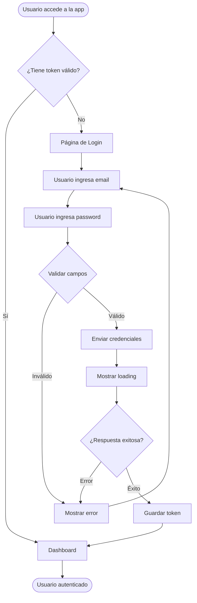
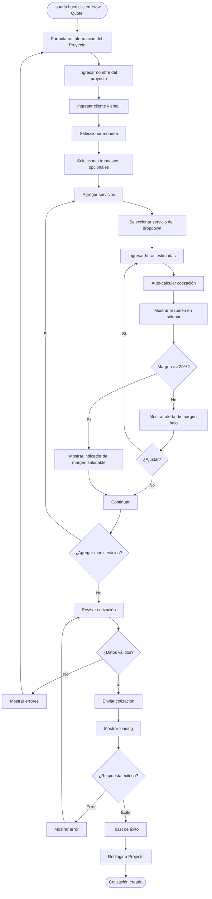
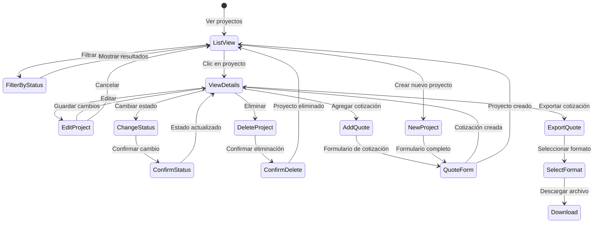
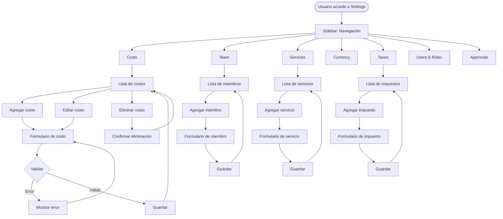
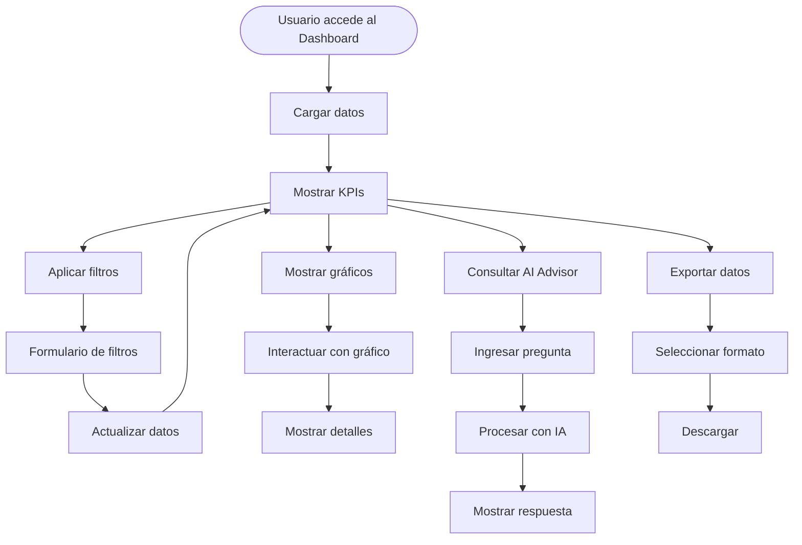
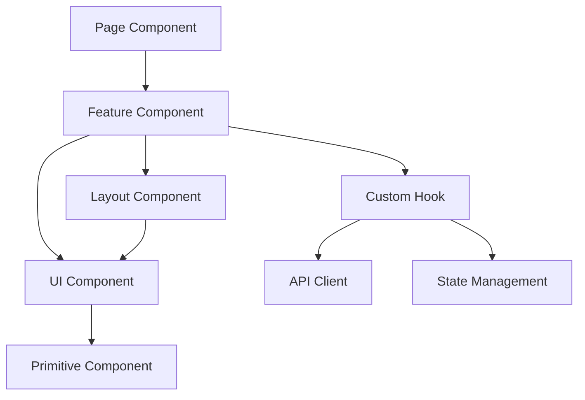
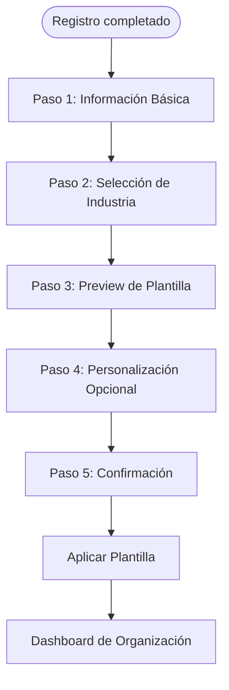
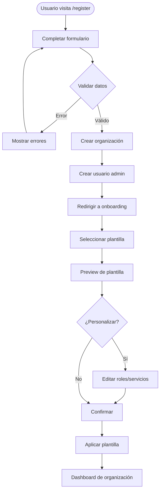
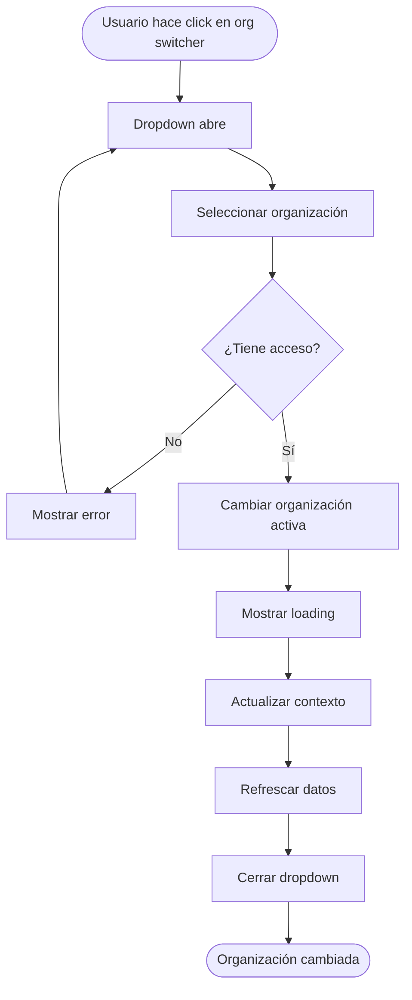
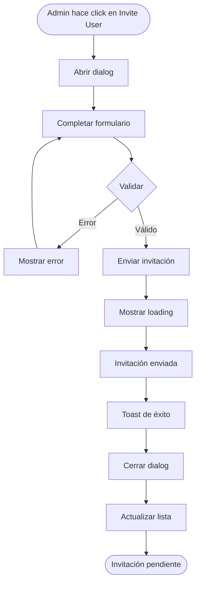

# PRD: Mejoras de UX/UI - AgenciaOps

**Versión:** 1.0  
**Fecha:** Diciembre 2025  
**Estado:** En Planificación

---

## 1. Resumen Ejecutivo

### 1.1 Objetivos

Mejorar la experiencia de usuario (UX) y la interfaz de usuario (UI) de AgenciaOps mediante la implementación de un sistema de diseño consistente basado en Material Design, optimización de flujos de usuario y mejoras en la usabilidad general de la plataforma.

### 1.2 Alcance

- **Incluye:**
  - Sistema de diseño UI completo (Material Design)
  - Mejoras en todos los módulos principales (Dashboard, Projects, Settings, Login)
  - Documentación de flujos de usuario
  - Guías de implementación técnica
  - Especificaciones de accesibilidad

- **Excluye:**
  - Cambios en la lógica de negocio del backend
  - Nuevas funcionalidades (solo mejoras UX/UI)
  - Migración de datos

### 1.3 Métricas de Éxito

- **Reducción del tiempo de creación de cotización:** 50% menos tiempo
- **Mejora en satisfacción de usuario:** Score de usabilidad > 80/100
- **Reducción de errores de usuario:** < 5% de acciones con error
- **Accesibilidad:** Cumplimiento WCAG 2.1 AA
- **Consistencia visual:** 100% de componentes siguiendo el sistema de diseño

---

## 2. Análisis del Estado Actual

### 2.1 Evaluación de Componentes Existentes

**Componentes Actuales:**
- Shadcn/ui como base (Radix UI + Tailwind CSS)
- Componentes básicos implementados (Button, Card, Input, Table, etc.)
- Layout con Sidebar y Header
- Sistema de colores básico con variables CSS

**Problemas Identificados:**
1. Falta de consistencia en espaciado y tipografía
2. No hay sistema de elevación definido
3. Componentes no siguen completamente Material Design
4. Falta de estados visuales claros (hover, active, disabled)
5. Navegación puede mejorarse
6. Feedback visual limitado en acciones críticas

### 2.2 Oportunidades de Mejora

- Implementar sistema de diseño Material Design completo
- Mejorar feedback visual en operaciones críticas
- Optimizar flujos de usuario para reducir fricción
- Mejorar accesibilidad
- Implementar animaciones sutiles para mejor UX

---

## 3. Sistema de Diseño UI (Material Design)

### 3.1 Paleta de Colores

#### 3.1.1 Colores Primarios

```css
/* Light Mode */
--primary-50: #E3F2FD;   /* hsl(210, 100%, 97%) */
--primary-100: #BBDEFB;  /* hsl(210, 100%, 93%) */
--primary-200: #90CAF9;  /* hsl(210, 100%, 88%) */
--primary-300: #64B5F6;  /* hsl(210, 100%, 82%) */
--primary-400: #42A5F5;  /* hsl(210, 100%, 77%) */
--primary-500: #2196F3;  /* hsl(210, 100%, 72%) - Primary */
--primary-600: #1E88E5;  /* hsl(210, 100%, 67%) */
--primary-700: #1976D2;  /* hsl(210, 100%, 62%) - Primary Dark */
--primary-800: #1565C0;  /* hsl(210, 100%, 57%) */
--primary-900: #0D47A1;  /* hsl(210, 100%, 52%) */

/* Dark Mode */
--primary-50: #0D47A1;
--primary-500: #64B5F6;
--primary-700: #90CAF9;
```

**Uso:**
- `primary-500`: Botones principales, links activos
- `primary-700`: Hover states, elementos destacados
- `primary-100`: Backgrounds sutiles, estados disabled

#### 3.1.2 Colores Secundarios

```css
/* Grey Scale (Material Design) */
--grey-50: #FAFAFA;   /* hsl(0, 0%, 98%) */
--grey-100: #F5F5F5;  /* hsl(0, 0%, 96%) */
--grey-200: #EEEEEE;  /* hsl(0, 0%, 93%) */
--grey-300: #E0E0E0;  /* hsl(0, 0%, 88%) */
--grey-400: #BDBDBD;  /* hsl(0, 0%, 74%) */
--grey-500: #9E9E9E;  /* hsl(0, 0%, 62%) */
--grey-600: #757575;  /* hsl(0, 0%, 46%) */
--grey-700: #616161;  /* hsl(0, 0%, 38%) */
--grey-800: #424242;  /* hsl(0, 0%, 26%) */
--grey-900: #212121;  /* hsl(0, 0%, 13%) */
```

#### 3.1.3 Colores Semánticos

```css
/* Success */
--success-50: #E8F5E9;
--success-500: #4CAF50;  /* hsl(122, 39%, 50%) */
--success-700: #388E3C;

/* Error */
--error-50: #FFEBEE;
--error-500: #F44336;    /* hsl(4, 90%, 58%) */
--error-700: #D32F2F;

/* Warning */
--warning-50: #FFF3E0;
--warning-500: #FF9800;  /* hsl(36, 100%, 50%) */
--warning-700: #F57C00;

/* Info */
--info-50: #E3F2FD;
--info-500: #2196F3;
--info-700: #1976D2;
```

#### 3.1.4 Variables CSS para Tailwind

```typescript
// tailwind.config.ts
colors: {
  primary: {
    50: 'hsl(210, 100%, 97%)',
    100: 'hsl(210, 100%, 93%)',
    500: 'hsl(210, 100%, 72%)',
    700: 'hsl(210, 100%, 62%)',
  },
  success: {
    50: 'hsl(122, 39%, 95%)',
    500: 'hsl(122, 39%, 50%)',
    700: 'hsl(122, 39%, 40%)',
  },
  error: {
    50: 'hsl(4, 90%, 95%)',
    500: 'hsl(4, 90%, 58%)',
    700: 'hsl(4, 90%, 48%)',
  },
  warning: {
    50: 'hsl(36, 100%, 95%)',
    500: 'hsl(36, 100%, 50%)',
    700: 'hsl(36, 100%, 40%)',
  },
}
```

### 3.2 Tipografía

#### 3.2.1 Fuente Base

```css
font-family: 'Roboto', -apple-system, BlinkMacSystemFont, 'Segoe UI', sans-serif;
```

**Instalación:**
```html
<link rel="preconnect" href="https://fonts.googleapis.com">
<link href="https://fonts.googleapis.com/css2?family=Roboto:wght@300;400;500;700&display=swap" rel="stylesheet">
```

#### 3.2.2 Escala Tipográfica

| Estilo | Tamaño | Line Height | Font Weight | Uso |
|--------|--------|-------------|-------------|-----|
| Display | 57px | 64px (1.12) | 400 | Títulos principales de página |
| Headline | 32px | 40px (1.25) | 400 | Títulos de sección grandes |
| Title | 20px | 28px (1.4) | 500 | Títulos de sección |
| Body Large | 16px | 24px (1.5) | 400 | Texto de cuerpo principal |
| Body | 14px | 20px (1.43) | 400 | Texto de cuerpo |
| Label | 14px | 20px (1.43) | 500 | Labels de formularios |
| Caption | 12px | 16px (1.33) | 400 | Texto secundario, hints |

#### 3.2.3 Clases Tailwind Personalizadas

```typescript
// tailwind.config.ts
fontSize: {
  'display': ['57px', { lineHeight: '64px', fontWeight: '400' }],
  'headline': ['32px', { lineHeight: '40px', fontWeight: '400' }],
  'title': ['20px', { lineHeight: '28px', fontWeight: '500' }],
  'body-lg': ['16px', { lineHeight: '24px', fontWeight: '400' }],
  'body': ['14px', { lineHeight: '20px', fontWeight: '400' }],
  'label': ['14px', { lineHeight: '20px', fontWeight: '500' }],
  'caption': ['12px', { lineHeight: '16px', fontWeight: '400' }],
}
```

### 3.3 Espaciado y Layout

#### 3.3.1 Grid System (8px Base Unit)

```typescript
// Espaciado estándar
spacing: {
  'xs': '4px',   // 0.5 * 8px
  'sm': '8px',   // 1 * 8px
  'md': '16px',  // 2 * 8px
  'lg': '24px',  // 3 * 8px
  'xl': '32px',  // 4 * 8px
  '2xl': '48px', // 6 * 8px
  '3xl': '64px', // 8 * 8px
}
```

**Regla:** Todos los espaciados deben ser múltiplos de 8px.

#### 3.3.2 Padding y Margins Estándar

| Componente | Padding | Margin |
|------------|---------|--------|
| Card | 16px (md) | 16px (md) |
| Button (default) | 10px 16px | 0 |
| Input | 12px 16px | 0 |
| Table Cell | 16px | 0 |
| Dialog | 24px (lg) | 0 |

#### 3.3.3 Breakpoints Responsive

```typescript
screens: {
  'sm': '600px',   // Tablet portrait
  'md': '960px',   // Tablet landscape / Desktop small
  'lg': '1280px',  // Desktop
  'xl': '1920px',  // Desktop large
}
```

**Uso:**
- Mobile: 0-599px
- Tablet: 600-959px
- Desktop: 960px+

### 3.4 Elevación y Sombras

#### 3.4.1 Niveles de Elevación (Material Design)

```css
/* Elevation 0 (No shadow) */
--elevation-0: none;

/* Elevation 1 */
--elevation-1: 0px 2px 1px -1px rgba(0,0,0,0.2),
               0px 1px 1px 0px rgba(0,0,0,0.14),
               0px 1px 3px 0px rgba(0,0,0,0.12);

/* Elevation 2 */
--elevation-2: 0px 3px 1px -2px rgba(0,0,0,0.2),
               0px 2px 2px 0px rgba(0,0,0,0.14),
               0px 1px 5px 0px rgba(0,0,0,0.12);

/* Elevation 4 */
--elevation-4: 0px 2px 4px -1px rgba(0,0,0,0.2),
               0px 4px 5px 0px rgba(0,0,0,0.14),
               0px 1px 10px 0px rgba(0,0,0,0.12);

/* Elevation 8 */
--elevation-8: 0px 5px 5px -3px rgba(0,0,0,0.2),
               0px 8px 10px 1px rgba(0,0,0,0.14),
               0px 3px 14px 2px rgba(0,0,0,0.12);

/* Elevation 12 */
--elevation-12: 0px 7px 8px -4px rgba(0,0,0,0.2),
                0px 12px 17px 2px rgba(0,0,0,0.14),
                0px 5px 22px 4px rgba(0,0,0,0.12);

/* Elevation 16 */
--elevation-16: 0px 8px 10px -5px rgba(0,0,0,0.2),
                0px 16px 24px 2px rgba(0,0,0,0.14),
                0px 6px 30px 5px rgba(0,0,0,0.12);

/* Elevation 24 */
--elevation-24: 0px 11px 15px -7px rgba(0,0,0,0.2),
                0px 24px 38px 3px rgba(0,0,0,0.14),
                0px 9px 46px 8px rgba(0,0,0,0.12);
```

#### 3.4.2 Uso por Componente

| Componente | Elevación | Uso |
|------------|-----------|-----|
| Card (default) | 2 | Cards en listas |
| Card (hover) | 8 | Cards interactivos |
| Dialog | 24 | Modales, dialogs |
| Dropdown | 8 | Menús desplegables |
| App Bar | 4 | Header fijo |
| FAB | 6 | Botones flotantes |

### 3.5 Componentes Base

#### 3.5.1 Botones

**Variantes:**
- `contained` (default): Botón principal con fondo sólido
- `outlined`: Botón con borde, sin fondo
- `text`: Botón de texto sin borde ni fondo
- `icon`: Botón solo con icono

**Estados:**
- Default
- Hover (elevation +1)
- Active (elevation -1)
- Disabled (opacity 0.38)
- Loading (spinner)

**Especificación Técnica:**

```typescript
// Button variants
const buttonVariants = cva(
  "inline-flex items-center justify-center rounded-md font-medium transition-all duration-200 focus-visible:outline-none focus-visible:ring-2 focus-visible:ring-primary-500 focus-visible:ring-offset-2 disabled:pointer-events-none disabled:opacity-38",
  {
    variants: {
      variant: {
        contained: "bg-primary-500 text-white hover:bg-primary-700 hover:shadow-elevation-2 active:shadow-elevation-1",
        outlined: "border-2 border-primary-500 text-primary-500 bg-transparent hover:bg-primary-50 active:bg-primary-100",
        text: "text-primary-500 bg-transparent hover:bg-primary-50 active:bg-primary-100",
        icon: "rounded-full p-2 text-primary-500 hover:bg-primary-50",
      },
      size: {
        sm: "h-9 px-3 text-sm",
        md: "h-10 px-4 text-body",
        lg: "h-11 px-6 text-body-lg",
        icon: "h-10 w-10",
      },
    },
    defaultVariants: {
      variant: "contained",
      size: "md",
    },
  }
);
```

#### 3.5.2 Inputs y Formularios

**Especificación:**

```typescript
// Input base styles
const inputBase = "flex h-10 w-full rounded-md border border-grey-300 bg-white px-3 py-2 text-body ring-offset-background file:border-0 file:bg-transparent file:text-sm file:font-medium placeholder:text-grey-500 focus-visible:outline-none focus-visible:ring-2 focus-visible:ring-primary-500 focus-visible:ring-offset-2 disabled:cursor-not-allowed disabled:opacity-50";

// Label styles
const labelBase = "text-sm font-medium text-grey-700 mb-2 block";

// Error state
const inputError = "border-error-500 focus-visible:ring-error-500";
```

**Estados:**
- Default: Borde gris, fondo blanco
- Focus: Borde primary, ring de 2px
- Error: Borde rojo, ring rojo
- Disabled: Opacity 0.5, cursor not-allowed

#### 3.5.3 Cards

**Especificación:**

```typescript
const cardBase = "rounded-lg border border-grey-200 bg-white shadow-elevation-2 transition-shadow duration-200";
const cardHover = "hover:shadow-elevation-8 cursor-pointer";
```

**Padding estándar:**
- Header: `p-6 pb-4`
- Content: `p-6`
- Footer: `p-6 pt-4`

#### 3.5.4 Tablas

**Especificación:**

```typescript
// Table styles
const tableBase = "w-full border-collapse";
const tableHeader = "bg-grey-50 text-left text-sm font-medium text-grey-700";
const tableCell = "px-4 py-3 text-body border-b border-grey-200";
const tableRowHover = "hover:bg-grey-50 transition-colors";
```

#### 3.5.5 Dialogs y Modales

**Especificación:**

```typescript
// Dialog overlay
const dialogOverlay = "fixed inset-0 bg-black/50 backdrop-blur-sm z-50";

// Dialog content
const dialogContent = "fixed left-1/2 top-1/2 -translate-x-1/2 -translate-y-1/2 w-full max-w-lg bg-white rounded-lg shadow-elevation-24 p-6 z-50";
```

**Animación:**
- Fade in overlay: 200ms
- Scale in content: 200ms ease-out

---

## 4. Flujos de Usuarios

### 4.1 Flujo de Autenticación



**Estados del Flujo:**
1. **Inicial:** Formulario vacío, botón deshabilitado
2. **Validando:** Campos con validación en tiempo real
3. **Enviando:** Botón con spinner, formulario deshabilitado
4. **Error:** Mensaje de error visible, formulario habilitado
5. **Éxito:** Redirección automática al dashboard

**Mejoras UX:**
- Validación en tiempo real (email format, password length)
- Feedback visual inmediato
- Mensajes de error claros y específicos
- Opción "Recordar sesión" (futuro)

### 4.2 Flujo de Creación de Cotización



**Estados del Flujo:**
1. **Formulario vacío:** Todos los campos vacíos, botón "Create" deshabilitado
2. **Completando información:** Validación en tiempo real
3. **Agregando servicios:** Lista de servicios vacía o con items
4. **Calculando:** Spinner en resumen mientras calcula
5. **Margen bajo:** Alerta visible, opción de ajustar
6. **Listo para enviar:** Todos los campos válidos, botón habilitado
7. **Enviando:** Loading state, formulario deshabilitado
8. **Éxito/Error:** Feedback y redirección

**Mejoras UX:**
- Auto-cálculo en tiempo real (debounce 500ms)
- Resumen siempre visible en sidebar
- Alertas visuales para márgenes bajos
- Validación antes de enviar
- Feedback claro de éxito/error

### 4.3 Flujo de Gestión de Proyectos



**Estados de Proyecto:**
- **Draft:** Borrador, en edición
- **Sent:** Enviado al cliente
- **Won:** Ganado/Aceptado
- **Lost:** Perdido/Rechazado

**Mejoras UX:**
- Filtros visuales por estado (cards clickeables)
- Cambio de estado inline con confirmación
- Vista de detalles mejorada con tabs
- Acciones rápidas desde la lista

### 4.4 Flujo de Configuración



**Mejoras UX:**
- Navegación clara por secciones
- Formularios consistentes
- Validación en tiempo real
- Confirmaciones para eliminaciones
- Estados vacíos informativos

### 4.5 Flujo de Dashboard



**Mejoras UX:**
- Carga progresiva de datos
- Filtros colapsables
- Gráficos interactivos
- AI Advisor con estado de carga
- Exportación rápida

---

## 5. Mejoras por Módulo

### 5.1 Dashboard

#### 5.1.1 Layout Mejorado

**Grid System:**
```typescript
// Grid de KPIs: 3 columnas en desktop, 2 en tablet, 1 en mobile
<div className="grid grid-cols-1 md:grid-cols-2 lg:grid-cols-3 gap-6">
  {kpis.map(kpi => <KPICard key={kpi.id} {...kpi} />)}
</div>

// Grid de gráficos: 2 columnas en desktop, 1 en mobile
<div className="grid grid-cols-1 lg:grid-cols-2 gap-6">
  <ChartCard />
  <ChartCard />
</div>
```

#### 5.1.2 Cards de KPI Mejoradas

**Especificación:**
- Elevación: 2 (default), 8 (hover)
- Padding: 24px
- Icono: 24px, color primary
- Valor: Display size, bold
- Descripción: Caption, muted
- Cambio porcentual: Badge con color semántico

#### 5.1.3 Filtros Mejorados

**Diseño:**
- Card colapsable
- Grid responsive de inputs
- Botones de acción claros
- Indicador visual de filtros activos
- Botón "Clear all" visible cuando hay filtros

### 5.2 Projects

#### 5.2.1 Tabla Mejorada

**Mejoras:**
- Hover state en filas
- Acciones inline con iconos
- Estado visual claro (badges de color)
- Cambio de estado inline con dropdown
- Paginación si hay muchos proyectos

#### 5.2.2 Filtros Visuales

**Cards de Estado:**
- Cards clickeables con contador
- Estado activo destacado
- Transición suave al cambiar filtro
- Contador actualizado en tiempo real

#### 5.2.3 Vista de Detalle

**Layout:**
- Header con información principal
- Tabs para: Overview, Quotes, History
- Sidebar con acciones rápidas
- Resumen financiero destacado

### 5.3 Settings

#### 5.3.1 Navegación Mejorada

**Sidebar:**
- Iconos consistentes
- Estado activo claro
- Badges para notificaciones (ej: Approvals)
- Agrupación lógica de secciones

#### 5.3.2 Formularios Mejorados

**Mejoras:**
- Validación en tiempo real
- Mensajes de error claros
- Helpers text cuando sea necesario
- Estados de guardado (saving, saved, error)

#### 5.3.3 Tablas de Configuración

**Mejoras:**
- Acciones inline claras
- Confirmación de eliminación
- Estados vacíos informativos
- Búsqueda y filtrado cuando aplique

### 5.4 Login

#### 5.4.1 Diseño Moderno

**Layout:**
- Centrado vertical y horizontal
- Card con elevación 8
- Logo prominente
- Formulario limpio

#### 5.4.2 Validación Mejorada

**Mejoras:**
- Validación en tiempo real
- Mensajes de error específicos
- Indicadores visuales de campos requeridos
- Botón con estado de carga

---

## 6. Patrones de Interacción

### 6.1 Navegación

**Principios:**
- Breadcrumbs para navegación profunda
- Sidebar siempre visible en desktop
- Header con información contextual
- Navegación por teclado (Tab, Enter, Esc)

### 6.2 Formularios

**Principios:**
- Validación en tiempo real
- Mensajes de error claros y específicos
- Helpers text cuando sea necesario
- Estados de carga en botones
- Confirmación antes de acciones destructivas

### 6.3 Feedback y Notificaciones

**Tipos:**
- **Toast:** Notificaciones temporales (3-5s)
- **Alert:** Alertas importantes en página
- **Dialog:** Confirmaciones críticas
- **Loading:** Estados de carga

**Especificación Toast:**
```typescript
// Posición: Top-right
// Duración: 5s (success), 7s (error)
// Animación: Slide in from right, fade out
// Acción: Botón de cerrar siempre visible
```

### 6.4 Estados de Carga

**Tipos:**
- **Skeleton:** Para contenido que se carga
- **Spinner:** Para acciones en progreso
- **Progress Bar:** Para procesos largos
- **Skeleton Screen:** Para páginas completas

### 6.5 Manejo de Errores

**Principios:**
- Mensajes claros y accionables
- No usar términos técnicos
- Ofrecer solución cuando sea posible
- No bloquear la UI innecesariamente

### 6.6 Búsqueda y Filtrado

**Principios:**
- Búsqueda con debounce (300ms)
- Filtros visibles y claros
- Resultados en tiempo real
- Indicador de resultados encontrados

---

## 7. Responsive Design

### 7.1 Breakpoints

```typescript
screens: {
  'sm': '600px',   // Tablet portrait
  'md': '960px',   // Tablet landscape
  'lg': '1280px',  // Desktop
  'xl': '1920px',  // Desktop large
}
```

### 7.2 Adaptaciones Móviles

**Sidebar:**
- Drawer en mobile (slide from left)
- Overlay cuando está abierto
- Cerrar al hacer clic fuera o en overlay

**Tablas:**
- Cards en mobile en lugar de tabla
- Información esencial visible
- Acciones en menú contextual

**Formularios:**
- Full width en mobile
- Inputs más grandes (touch targets)
- Botones full width en mobile

### 7.3 Touch Targets

**Tamaño mínimo:** 48x48px (Material Design)
**Espaciado:** Mínimo 8px entre targets

---

## 8. Accesibilidad (WCAG 2.1 AA)

### 8.1 Contraste de Colores

**Ratios mínimos:**
- Texto normal: 4.5:1
- Texto grande (18px+): 3:1
- Componentes UI: 3:1

### 8.2 Navegación por Teclado

**Requisitos:**
- Todos los elementos interactivos accesibles por teclado
- Orden lógico de tab
- Focus visible (ring de 2px)
- Atajos de teclado documentados

### 8.3 Screen Readers

**Requisitos:**
- ARIA labels en elementos interactivos
- Roles semánticos correctos
- Estados anunciados (loading, error, success)
- Landmarks para navegación

### 8.4 Focus Management

**Principios:**
- Focus trap en modales
- Restaurar focus al cerrar modales
- Focus visible siempre
- Skip links para navegación rápida

---

## 9. Animaciones y Transiciones

### 9.1 Timing Functions

```css
/* Estándar Material Design */
--ease-standard: cubic-bezier(0.4, 0.0, 0.2, 1);
--ease-decelerate: cubic-bezier(0.0, 0.0, 0.2, 1);
--ease-accelerate: cubic-bezier(0.4, 0.0, 1, 1);
--ease-sharp: cubic-bezier(0.4, 0.0, 0.6, 1);
```

### 9.2 Duración Estándar

```css
--duration-short: 150ms;   /* Microinteracciones */
--duration-medium: 250ms;  /* Transiciones estándar */
--duration-long: 350ms;    /* Transiciones complejas */
```

### 9.3 Microinteracciones

**Ejemplos:**
- Hover en botones: Elevación +1, 200ms
- Click en botones: Elevación -1, 100ms
- Hover en cards: Elevación +2, 200ms
- Focus en inputs: Ring aparece, 150ms

### 9.4 Transiciones de Página

**Principio:** Fade in/out, 200ms

---

## 10. Guía de Implementación

### 10.1 Orden de Trabajo Recomendado

**Fase 1: Fundación (Semana 1-2)**
1. Actualizar sistema de colores en Tailwind
2. Implementar tipografía Roboto
3. Crear tokens de espaciado
4. Implementar sistema de elevación
5. Actualizar componentes base (Button, Input, Card)

**Fase 2: Componentes (Semana 3-4)**
1. Mejorar componentes existentes
2. Crear componentes faltantes
3. Implementar estados (hover, active, disabled)
4. Agregar animaciones básicas

**Fase 3: Páginas (Semana 5-6)**
1. Mejorar Login
2. Mejorar Dashboard
3. Mejorar Projects
4. Mejorar Settings

**Fase 4: Pulido (Semana 7-8)**
1. Responsive design
2. Accesibilidad
3. Testing de usabilidad
4. Ajustes finales

### 10.2 Dependencias

**Nuevas dependencias necesarias:**
```json
{
  "framer-motion": "^10.16.0",  // Animaciones avanzadas (opcional)
  "@radix-ui/react-tooltip": "^1.0.7",  // Tooltips
  "@radix-ui/react-progress": "^1.0.0"  // Progress bars
}
```

### 10.3 Testing

**Tipos de testing:**
- **Visual:** Comparar con diseño
- **Funcional:** Verificar interacciones
- **Accesibilidad:** Usar herramientas (axe, WAVE)
- **Responsive:** Probar en diferentes tamaños
- **Usabilidad:** Testing con usuarios

---

## 11. Criterios de Aceptación

### 11.1 Sistema de Diseño

- [ ] Todos los colores siguen la paleta Material Design
- [ ] Tipografía Roboto implementada correctamente
- [ ] Espaciado sigue grid de 8px
- [ ] Elevación implementada en todos los componentes
- [ ] Componentes base siguen especificaciones

### 11.2 Flujos de Usuario

- [ ] Flujo de autenticación funciona sin fricción
- [ ] Creación de cotización es intuitiva y rápida
- [ ] Gestión de proyectos es clara
- [ ] Configuración es fácil de navegar
- [ ] Dashboard muestra información relevante

### 11.3 Responsive Design

- [ ] Funciona correctamente en mobile (320px+)
- [ ] Funciona correctamente en tablet (600px+)
- [ ] Funciona correctamente en desktop (960px+)
- [ ] Touch targets son adecuados (48x48px mínimo)

### 11.4 Accesibilidad

- [ ] Contraste de colores cumple WCAG 2.1 AA
- [ ] Navegación por teclado funciona
- [ ] Screen readers pueden navegar
- [ ] Focus management es correcto
- [ ] ARIA labels implementados

### 11.5 Performance

- [ ] Animaciones son fluidas (60fps)
- [ ] Carga inicial < 3s
- [ ] Transiciones no bloquean UI
- [ ] Imágenes optimizadas

---

## 12. Referencias y Recursos

### 12.1 Material Design

- [Material Design Guidelines](https://material.io/design)
- [Material Design Components](https://material.io/components)
- [Material Design Color Tool](https://material.io/resources/color/)

### 12.2 Accesibilidad

- [WCAG 2.1 Guidelines](https://www.w3.org/WAI/WCAG21/quickref/)
- [WebAIM Contrast Checker](https://webaim.org/resources/contrastchecker/)
- [ARIA Authoring Practices](https://www.w3.org/WAI/ARIA/apg/)

### 12.3 Herramientas

- [Tailwind CSS](https://tailwindcss.com/)
- [Shadcn/ui](https://ui.shadcn.com/)
- [Radix UI](https://www.radix-ui.com/)
- [Framer Motion](https://www.framer.com/motion/) (opcional)

---

## 13. Arquitectura Escalable

### 13.1 Principios de Diseño Escalable

#### 13.1.1 Separación de Responsabilidades

**Estructura de Carpetas Recomendada:**

```
frontend/src/
├── app/                    # Next.js App Router (páginas)
│   ├── (app)/             # Rutas protegidas
│   │   ├── dashboard/
│   │   ├── projects/
│   │   └── settings/
│   └── page.tsx           # Login público
│
├── components/             # Componentes React
│   ├── ui/                # Componentes base reutilizables (Shadcn/ui)
│   ├── layout/            # Componentes de layout (Header, Sidebar)
│   ├── features/          # Componentes específicos de features
│   │   ├── projects/
│   │   ├── dashboard/
│   │   └── settings/
│   └── common/            # Componentes compartidos
│
├── lib/                   # Utilidades y configuraciones
│   ├── api-client.ts      # Cliente API centralizado
│   ├── queries.ts         # TanStack Query hooks
│   ├── utils.ts           # Funciones utilitarias
│   ├── constants.ts       # Constantes de la aplicación
│   └── types/             # TypeScript types compartidos
│
├── hooks/                 # Custom hooks
│   ├── use-crud.ts       # Hook genérico para CRUD
│   └── use-toast.ts      # Hook para notificaciones
│
├── providers/             # Context providers
│   └── query-provider.tsx # TanStack Query provider
│
└── styles/               # Estilos globales
    └── globals.css
```

**Reglas:**
- **UI Components (`components/ui/`)**: Componentes puros, sin lógica de negocio, reutilizables
- **Feature Components (`components/features/`)**: Componentes específicos de dominio, pueden tener lógica
- **Pages (`app/`)**: Solo orquestación, mínima lógica
- **Hooks (`hooks/`)**: Lógica reutilizable extraída de componentes
- **Lib (`lib/`)**: Utilidades puras, sin dependencias de React

#### 13.1.2 Composición sobre Herencia

**Patrón: Compound Components**

```typescript
// ❌ Mal: Componente monolítico
<Card title="Title" description="Desc" actions={[...]} />

// ✅ Bien: Componente compuesto
<Card>
  <CardHeader>
    <CardTitle>Title</CardTitle>
    <CardDescription>Desc</CardDescription>
  </CardHeader>
  <CardContent>Content</CardContent>
  <CardFooter>
    <Button>Action</Button>
  </CardFooter>
</Card>
```

**Ventajas:**
- Flexibilidad máxima
- Reutilización de sub-componentes
- Fácil de extender
- Mejor para testing

#### 13.1.3 Single Source of Truth

**Sistema de Tokens de Diseño Centralizado:**

```typescript
// lib/design-tokens.ts
export const designTokens = {
  colors: {
    primary: {
      50: 'hsl(210, 100%, 97%)',
      500: 'hsl(210, 100%, 72%)',
      700: 'hsl(210, 100%, 62%)',
    },
    // ... resto de colores
  },
  spacing: {
    xs: '4px',
    sm: '8px',
    md: '16px',
    lg: '24px',
    xl: '32px',
  },
  typography: {
    fontFamily: {
      sans: ['Roboto', 'sans-serif'],
    },
    fontSize: {
      display: ['57px', { lineHeight: '64px' }],
      headline: ['32px', { lineHeight: '40px' }],
      // ...
    },
  },
  elevation: {
    0: 'none',
    2: '0px 3px 1px -2px rgba(0,0,0,0.2), ...',
    // ...
  },
} as const;

// Exportar tipos derivados
export type ColorToken = typeof designTokens.colors;
export type SpacingToken = typeof designTokens.spacing;
```

**Uso en Tailwind:**

```typescript
// tailwind.config.ts
import { designTokens } from './src/lib/design-tokens';

export default {
  theme: {
    extend: {
      colors: designTokens.colors,
      spacing: designTokens.spacing,
      fontFamily: designTokens.typography.fontFamily,
      // ...
    },
  },
};
```

### 13.2 Arquitectura de Componentes

#### 13.2.1 Jerarquía de Componentes



**Niveles:**

1. **Page Components** (`app/**/page.tsx`)
   - Orquestación de features
   - Mínima lógica
   - Solo layout y routing

2. **Feature Components** (`components/features/**`)
   - Lógica de dominio específica
   - Pueden usar hooks personalizados
   - Composición de UI components

3. **Layout Components** (`components/layout/**`)
   - Estructura de página
   - Navegación
   - Headers, Sidebars

4. **UI Components** (`components/ui/**`)
   - Componentes base reutilizables
   - Sin lógica de negocio
   - Props bien definidas

5. **Primitive Components**
   - Elementos HTML básicos estilizados
   - Máxima reutilización

#### 13.2.2 Patrón de Componentes

**Template de Componente Escalable:**

```typescript
// components/features/projects/project-card.tsx
import { memo } from 'react';
import { Card, CardHeader, CardTitle, CardContent } from '@/components/ui/card';
import { Button } from '@/components/ui/button';
import { Project } from '@/lib/types';
import { cn } from '@/lib/utils';

interface ProjectCardProps {
  project: Project;
  onEdit?: (id: number) => void;
  onDelete?: (id: number) => void;
  className?: string;
}

// Memoizar para evitar re-renders innecesarios
export const ProjectCard = memo<ProjectCardProps>(({
  project,
  onEdit,
  onDelete,
  className,
}) => {
  return (
    <Card className={cn('hover:shadow-elevation-8 transition-shadow', className)}>
      <CardHeader>
        <CardTitle>{project.name}</CardTitle>
      </CardHeader>
      <CardContent>
        {/* Contenido */}
        <div className="flex gap-2 mt-4">
          {onEdit && (
            <Button variant="outlined" onClick={() => onEdit(project.id)}>
              Edit
            </Button>
          )}
          {onDelete && (
            <Button variant="text" onClick={() => onDelete(project.id)}>
              Delete
            </Button>
          )}
        </div>
      </CardContent>
    </Card>
  );
});

ProjectCard.displayName = 'ProjectCard';
```

**Características:**
- TypeScript estricto
- Props opcionales bien definidas
- Memoización cuando sea necesario
- Composición flexible
- Clases condicionales con `cn()`

### 13.3 Gestión de Estado Escalable

#### 13.3.1 Estrategia de Estado

**Jerarquía de Estado:**

```
1. Server State (TanStack Query)
   └── Datos del servidor, caché, sincronización

2. URL State (Next.js Router)
   └── Filtros, búsquedas, paginación

3. Form State (React Hook Form)
   └── Estado de formularios locales

4. UI State (useState/useReducer)
   └── Modales, dropdowns, toggles

5. Global State (Zustand - solo si necesario)
   └── Estado compartido entre features distantes
```

#### 13.3.2 TanStack Query para Server State

**Configuración Escalable:**

```typescript
// lib/query-client.ts
import { QueryClient } from '@tanstack/react-query';

export const queryClient = new QueryClient({
  defaultOptions: {
    queries: {
      staleTime: 5 * 60 * 1000, // 5 minutos
      cacheTime: 10 * 60 * 1000, // 10 minutos
      retry: 1,
      refetchOnWindowFocus: false,
      refetchOnMount: true,
    },
    mutations: {
      retry: 0,
    },
  },
});
```

**Query Keys Organizados:**

```typescript
// lib/query-keys.ts
export const queryKeys = {
  // Base keys
  services: ['services'] as const,
  projects: ['projects'] as const,
  team: ['team'] as const,
  
  // Nested keys con parámetros
  project: (id: number) => ['projects', id] as const,
  projectQuotes: (projectId: number) => ['projects', projectId, 'quotes'] as const,
  
  // Keys con filtros
  projectsFiltered: (filters: ProjectFilters) => 
    ['projects', 'filtered', filters] as const,
  
  // Keys para listas paginadas
  projectsPaginated: (page: number, limit: number) =>
    ['projects', 'paginated', page, limit] as const,
} as const;

// Type-safe query key factory
export type QueryKey = typeof queryKeys;
```

**Hooks Personalizados Escalables:**

```typescript
// hooks/use-projects.ts
import { useQuery, useMutation, useQueryClient } from '@tanstack/react-query';
import { queryKeys } from '@/lib/query-keys';
import { apiRequest } from '@/lib/api-client';

export function useProjects(filters?: ProjectFilters) {
  return useQuery({
    queryKey: queryKeys.projectsFiltered(filters || {}),
    queryFn: async () => {
      const response = await apiRequest('/projects/', {
        params: filters,
      });
      if (response.error) throw new Error(response.error);
      return response.data;
    },
    // Configuración específica
    enabled: !!filters, // Solo ejecutar si hay filtros
  });
}

export function useProject(id: number) {
  return useQuery({
    queryKey: queryKeys.project(id),
    queryFn: async () => {
      const response = await apiRequest(`/projects/${id}`);
      if (response.error) throw new Error(response.error);
      return response.data;
    },
    enabled: !!id, // Solo ejecutar si hay ID
  });
}

export function useCreateProject() {
  const queryClient = useQueryClient();
  
  return useMutation({
    mutationFn: async (data: CreateProjectData) => {
      const response = await apiRequest('/projects/', {
        method: 'POST',
        body: JSON.stringify(data),
      });
      if (response.error) throw new Error(response.error);
      return response.data;
    },
    onSuccess: () => {
      // Invalidar queries relacionadas
      queryClient.invalidateQueries({ queryKey: queryKeys.projects });
    },
    // Optimistic update
    onMutate: async (newProject) => {
      // Cancelar queries en progreso
      await queryClient.cancelQueries({ queryKey: queryKeys.projects });
      
      // Snapshot del estado anterior
      const previousProjects = queryClient.getQueryData(queryKeys.projects);
      
      // Optimistic update
      queryClient.setQueryData(queryKeys.projects, (old: Project[] = []) => [
        ...old,
        { ...newProject, id: Date.now() }, // ID temporal
      ]);
      
      return { previousProjects };
    },
    onError: (err, newProject, context) => {
      // Rollback en caso de error
      if (context?.previousProjects) {
        queryClient.setQueryData(queryKeys.projects, context.previousProjects);
      }
    },
  });
}
```

#### 13.3.3 React Hook Form para Form State

**Formulario Escalable:**

```typescript
// components/features/projects/project-form.tsx
import { useForm } from 'react-hook-form';
import { zodResolver } from '@hookform/resolvers/zod';
import { z } from 'zod';
import { Form, FormField, FormItem, FormLabel, FormControl, FormMessage } from '@/components/ui/form';
import { Input } from '@/components/ui/input';
import { Button } from '@/components/ui/button';

// Schema de validación (compartido con backend)
const projectSchema = z.object({
  name: z.string().min(1, 'Name is required').max(100),
  client_name: z.string().min(1, 'Client name is required'),
  client_email: z.string().email('Invalid email').optional(),
  currency: z.enum(['USD', 'EUR', 'COP', 'ARS']),
});

type ProjectFormData = z.infer<typeof projectSchema>;

interface ProjectFormProps {
  initialData?: Partial<ProjectFormData>;
  onSubmit: (data: ProjectFormData) => Promise<void>;
  onCancel?: () => void;
}

export function ProjectForm({ initialData, onSubmit, onCancel }: ProjectFormProps) {
  const form = useForm<ProjectFormData>({
    resolver: zodResolver(projectSchema),
    defaultValues: initialData || {
      name: '',
      client_name: '',
      client_email: '',
      currency: 'USD',
    },
  });

  const handleSubmit = async (data: ProjectFormData) => {
    try {
      await onSubmit(data);
      form.reset();
    } catch (error) {
      // Error handling
    }
  };

  return (
    <Form {...form}>
      <form onSubmit={form.handleSubmit(handleSubmit)} className="space-y-4">
        <FormField
          control={form.control}
          name="name"
          render={({ field }) => (
            <FormItem>
              <FormLabel>Project Name</FormLabel>
              <FormControl>
                <Input {...field} />
              </FormControl>
              <FormMessage />
            </FormItem>
          )}
        />
        {/* Más campos */}
        <div className="flex gap-2">
          <Button type="submit">Save</Button>
          {onCancel && (
            <Button type="button" variant="outlined" onClick={onCancel}>
              Cancel
            </Button>
          )}
        </div>
      </form>
    </Form>
  );
}
```

### 13.4 Performance y Optimización

#### 13.4.1 Code Splitting y Lazy Loading

**Lazy Loading de Componentes:**

```typescript
// app/(app)/dashboard/page.tsx
import { lazy, Suspense } from 'react';
import { Card, CardContent } from '@/components/ui/card';
import { Loader2 } from 'lucide-react';

// Lazy load componente pesado
const AIAdvisor = lazy(() => 
  import('@/components/features/dashboard/ai-advisor').then(module => ({
    default: module.AIAdvisor,
  }))
);

export default function DashboardPage() {
  return (
    <div className="space-y-6">
      {/* Componentes críticos cargados normalmente */}
      <KPICards />
      
      {/* Componente pesado lazy loaded */}
      <Suspense
        fallback={
          <Card>
            <CardContent className="flex items-center justify-center h-[200px]">
              <Loader2 className="h-6 w-6 animate-spin" />
            </CardContent>
          </Card>
        }
      >
        <AIAdvisor />
      </Suspense>
    </div>
  );
}
```

**Route-based Code Splitting (Next.js automático):**

```typescript
// Next.js automáticamente hace code splitting por ruta
// app/(app)/dashboard/page.tsx -> dashboard.js chunk
// app/(app)/projects/page.tsx -> projects.js chunk
```

#### 13.4.2 Memoización Estratégica

**Cuándo usar `memo`:**

```typescript
// ✅ Bien: Componente que recibe props que cambian poco
const ProjectCard = memo<ProjectCardProps>(({ project, onEdit }) => {
  // ...
}, (prevProps, nextProps) => {
  // Comparación personalizada
  return prevProps.project.id === nextProps.project.id &&
         prevProps.project.status === nextProps.project.status;
});

// ✅ Bien: Lista grande de items
const ProjectList = memo(({ projects }: { projects: Project[] }) => {
  return (
    <div>
      {projects.map(project => (
        <ProjectCard key={project.id} project={project} />
      ))}
    </div>
  );
});

// ❌ Mal: Componente simple que siempre re-renderiza
const SimpleButton = memo(({ onClick }: { onClick: () => void }) => {
  return <button onClick={onClick}>Click</button>;
});
```

**useMemo y useCallback:**

```typescript
// ✅ Bien: Cálculo costoso
const expensiveValue = useMemo(() => {
  return projects.reduce((acc, project) => acc + project.revenue, 0);
}, [projects]);

// ✅ Bien: Callback estable para props
const handleEdit = useCallback((id: number) => {
  router.push(`/projects/${id}/edit`);
}, [router]);

// ❌ Mal: Cálculo simple
const simpleValue = useMemo(() => projects.length, [projects]);
```

#### 13.4.3 Virtualización para Listas Grandes

```typescript
// Para listas con > 100 items
import { useVirtualizer } from '@tanstack/react-virtual';

export function VirtualizedProjectList({ projects }: { projects: Project[] }) {
  const parentRef = useRef<HTMLDivElement>(null);
  
  const virtualizer = useVirtualizer({
    count: projects.length,
    getScrollElement: () => parentRef.current,
    estimateSize: () => 100, // Altura estimada de cada item
    overscan: 5, // Renderizar 5 items extra fuera de vista
  });

  return (
    <div ref={parentRef} className="h-[600px] overflow-auto">
      <div
        style={{
          height: `${virtualizer.getTotalSize()}px`,
          width: '100%',
          position: 'relative',
        }}
      >
        {virtualizer.getVirtualItems().map((virtualItem) => (
          <div
            key={virtualItem.key}
            style={{
              position: 'absolute',
              top: 0,
              left: 0,
              width: '100%',
              height: `${virtualItem.size}px`,
              transform: `translateY(${virtualItem.start}px)`,
            }}
          >
            <ProjectCard project={projects[virtualItem.index]} />
          </div>
        ))}
      </div>
    </div>
  );
}
```

#### 13.4.4 Image Optimization

```typescript
// Usar next/image para optimización automática
import Image from 'next/image';

export function ProjectImage({ src, alt }: { src: string; alt: string }) {
  return (
    <Image
      src={src}
      alt={alt}
      width={400}
      height={300}
      loading="lazy"
      placeholder="blur"
      blurDataURL="data:image/jpeg;base64,..."
    />
  );
}
```

### 13.5 Type Safety y Escalabilidad

#### 13.5.1 Tipos Compartidos

**Estructura de Tipos:**

```typescript
// lib/types/index.ts
export * from './project';
export * from './service';
export * from './team';
export * from './common';

// lib/types/project.ts
export interface Project {
  id: number;
  name: string;
  client_name: string;
  client_email?: string;
  status: ProjectStatus;
  currency: Currency;
  created_at: string;
  updated_at?: string;
}

export type ProjectStatus = 'Draft' | 'Sent' | 'Won' | 'Lost';
export type Currency = 'USD' | 'EUR' | 'COP' | 'ARS';

export interface CreateProjectData {
  name: string;
  client_name: string;
  client_email?: string;
  currency: Currency;
  tax_ids?: number[];
  quote_items: QuoteItem[];
}

// lib/types/common.ts
export interface PaginatedResponse<T> {
  items: T[];
  total: number;
  page: number;
  page_size: number;
  total_pages: number;
}

export interface ApiError {
  error: string;
  detail?: string;
  code?: string;
}
```

#### 13.5.2 Type-Safe API Client

```typescript
// lib/api-client.ts
type HttpMethod = 'GET' | 'POST' | 'PUT' | 'PATCH' | 'DELETE';

interface ApiRequestOptions<T = unknown> {
  method?: HttpMethod;
  body?: T;
  params?: Record<string, string | number | boolean>;
  headers?: Record<string, string>;
}

export async function apiRequest<TResponse = unknown, TBody = unknown>(
  endpoint: string,
  options: ApiRequestOptions<TBody> = {}
): Promise<{ data: TResponse; error?: never } | { data?: never; error: string }> {
  const { method = 'GET', body, params, headers = {} } = options;
  
  // Construir URL con query params
  const url = new URL(`${API_BASE}${endpoint}`, window.location.origin);
  if (params) {
    Object.entries(params).forEach(([key, value]) => {
      url.searchParams.append(key, String(value));
    });
  }
  
  // Headers
  const requestHeaders: HeadersInit = {
    'Content-Type': 'application/json',
    ...headers,
  };
  
  // Token de autenticación
  const token = localStorage.getItem('auth_token');
  if (token) {
    requestHeaders['Authorization'] = `Bearer ${token}`;
  }
  
  try {
    const response = await fetch(url.toString(), {
      method,
      headers: requestHeaders,
      body: body ? JSON.stringify(body) : undefined,
    });
    
    const data = await response.json();
    
    if (!response.ok) {
      return { error: data.detail || data.error || 'An error occurred' };
    }
    
    return { data: data as TResponse };
  } catch (error) {
    return { error: error instanceof Error ? error.message : 'Network error' };
  }
}

// Uso type-safe
const { data, error } = await apiRequest<Project>('/projects/1');
if (data) {
  // TypeScript sabe que data es Project
  console.log(data.name);
}
```

### 13.6 Testing Escalable

#### 13.6.1 Estructura de Tests

```
frontend/
├── src/
│   └── components/
│       └── ui/
│           └── button.tsx
└── __tests__/
    └── components/
        └── ui/
            └── button.test.tsx
```

#### 13.6.2 Testing de Componentes

```typescript
// __tests__/components/ui/button.test.tsx
import { render, screen, fireEvent } from '@testing-library/react';
import { Button } from '@/components/ui/button';

describe('Button', () => {
  it('renders with correct text', () => {
    render(<Button>Click me</Button>);
    expect(screen.getByText('Click me')).toBeInTheDocument();
  });
  
  it('calls onClick when clicked', () => {
    const handleClick = jest.fn();
    render(<Button onClick={handleClick}>Click</Button>);
    
    fireEvent.click(screen.getByText('Click'));
    expect(handleClick).toHaveBeenCalledTimes(1);
  });
  
  it('is disabled when disabled prop is true', () => {
    render(<Button disabled>Disabled</Button>);
    expect(screen.getByText('Disabled')).toBeDisabled();
  });
});
```

#### 13.6.3 Testing de Hooks

```typescript
// __tests__/hooks/use-projects.test.tsx
import { renderHook, waitFor } from '@testing-library/react';
import { QueryClient, QueryClientProvider } from '@tanstack/react-query';
import { useProjects } from '@/hooks/use-projects';

const createWrapper = () => {
  const queryClient = new QueryClient({
    defaultOptions: { queries: { retry: false } },
  });
  return ({ children }: { children: React.ReactNode }) => (
    <QueryClientProvider client={queryClient}>
      {children}
    </QueryClientProvider>
  );
};

describe('useProjects', () => {
  it('fetches projects successfully', async () => {
    const { result } = renderHook(() => useProjects(), {
      wrapper: createWrapper(),
    });
    
    await waitFor(() => expect(result.current.isSuccess).toBe(true));
    expect(result.current.data).toBeDefined();
  });
});
```

### 13.7 Documentación de Componentes

#### 13.7.1 Storybook para Componentes

**Configuración:**

```typescript
// .storybook/main.ts
export default {
  stories: ['../src/components/**/*.stories.@(js|jsx|ts|tsx)'],
  addons: ['@storybook/addon-essentials'],
  framework: '@storybook/react',
};

// src/components/ui/button.stories.tsx
import type { Meta, StoryObj } from '@storybook/react';
import { Button } from './button';

const meta: Meta<typeof Button> = {
  title: 'UI/Button',
  component: Button,
  tags: ['autodocs'],
  argTypes: {
    variant: {
      control: 'select',
      options: ['contained', 'outlined', 'text', 'icon'],
    },
  },
};

export default meta;
type Story = StoryObj<typeof Button>;

export const Default: Story = {
  args: {
    children: 'Button',
  },
};

export const Outlined: Story = {
  args: {
    variant: 'outlined',
    children: 'Outlined Button',
  },
};
```

#### 13.7.2 JSDoc para Componentes

```typescript
/**
 * Button component following Material Design guidelines
 * 
 * @example
 * ```tsx
 * <Button variant="contained" onClick={handleClick}>
 *   Click me
 * </Button>
 * ```
 * 
 * @param variant - Visual style variant
 * @param size - Size of the button
 * @param disabled - Whether the button is disabled
 * @param children - Button content
 */
export const Button = ({ variant, size, disabled, children }: ButtonProps) => {
  // ...
};
```

### 13.8 Monorepo Considerations (Futuro)

**Estructura para Monorepo:**

```
monorepo/
├── apps/
│   ├── web/              # Next.js app
│   └── admin/           # Admin panel (futuro)
├── packages/
│   ├── ui/              # Componentes UI compartidos
│   ├── design-tokens/   # Tokens de diseño
│   ├── utils/           # Utilidades compartidas
│   └── types/           # Types compartidos
└── tools/
    └── eslint-config/   # Configuraciones compartidas
```

**Ventajas:**
- Componentes compartidos entre apps
- Design tokens centralizados
- Types compartidos
- Builds optimizados

### 13.9 Checklist de Escalabilidad

**Arquitectura:**
- [ ] Separación clara de responsabilidades
- [ ] Componentes reutilizables bien definidos
- [ ] Hooks personalizados para lógica reutilizable
- [ ] Types compartidos centralizados

**Performance:**
- [ ] Code splitting implementado
- [ ] Lazy loading de componentes pesados
- [ ] Memoización donde sea necesario
- [ ] Virtualización para listas grandes
- [ ] Images optimizadas

**Estado:**
- [ ] TanStack Query para server state
- [ ] React Hook Form para form state
- [ ] URL state para filtros/búsquedas
- [ ] Estado local cuando sea suficiente

**Testing:**
- [ ] Tests unitarios para componentes
- [ ] Tests de integración para features
- [ ] Tests de hooks personalizados
- [ ] Coverage > 80%

**Documentación:**
- [ ] Storybook para componentes UI
- [ ] JSDoc en funciones/componentes
- [ ] README por feature
- [ ] Guías de contribución

---

## 14. Requerimientos UX/UI Multi-Tenant

### 14.1 Contexto y Objetivos

**Objetivo:** Diseñar una experiencia de usuario clara y eficiente para la gestión de organizaciones multi-tenant, permitiendo que usuarios administren sus organizaciones, inviten miembros, configuren planes y realicen onboarding sin fricción.

**Principios de Diseño:**
- **Claridad:** El usuario siempre debe saber en qué organización está trabajando
- **Aislamiento Visual:** Los datos de diferentes organizaciones deben estar claramente separados
- **Onboarding Fluido:** El proceso de registro y setup inicial debe ser intuitivo y rápido
- **Gestión Simple:** Administrar usuarios, roles y configuraciones debe ser accesible

### 14.2 Flujo de Registro de Organización

#### 14.2.1 Página de Registro Público

**Ruta:** `/register`

**Layout:**
- Full screen, centered
- Background: Grey 50
- Card: 600px width, max-width 90vw

**Contenido del Formulario:**

**Paso 1: Información de la Organización**
- Organization Name (required)
  - Input text, placeholder: "e.g. Acme Creative Agency"
  - Validación: Min 3 caracteres, max 100
  - Helper text: "Este será el nombre visible de tu organización"
  
- Organization Slug (auto-generado, editable)
  - Input text, readonly inicialmente
  - Icono de editar para habilitar edición
  - Validación: Solo lowercase, números, guiones
  - Helper text: "URL única para tu organización"
  - Preview: `agenciops.com/acme-creative-agency`

**Paso 2: Tu Cuenta de Administrador**
- Full Name (required)
- Email (required)
- Password (required)
  - Mínimo 8 caracteres
  - Indicador de fortaleza visual
- Confirm Password (required)

**Paso 3: Configuración Inicial (Opcional)**
- Country/Region (select)
  - Opciones: US, UK, COL, ARG, MEX, ESP, BR, etc.
  - Helper: "Usado para ajustar salarios y costos"
- Default Currency (select)
  - Opciones: USD, EUR, COP, ARS, MXN, GBP, BRL
  - Default según país seleccionado

**Estados:**
- Default: Formulario vacío
- Validating: Validación en tiempo real
- Submitting: Botón con spinner, formulario deshabilitado
- Success: Mensaje de éxito + redirección a onboarding
- Error: Mensaje de error específico

**Mejoras UX:**
- Progress indicator (3 pasos)
- Validación en tiempo real
- Auto-generación de slug desde nombre
- Preview de slug en tiempo real
- Indicador de fortaleza de contraseña
- Mensajes de error claros y específicos

#### 14.2.2 Flujo de Onboarding con Plantillas

**Ruta:** `/onboarding` (después de registro)

**Flujo Multi-Step:**



**Paso 1: Información Básica**
- Revisar información de organización
- Confirmar país y moneda
- Botón "Continuar"

**Paso 2: Selección de Industria**

**Layout:**
- Grid de cards (2 columnas desktop, 1 mobile)
- Cada card representa una plantilla

**Template Card:**
- Elevation: 2 (default), 8 (hover, selected)
- Padding: 24px
- Border: 2px transparent (default), Primary 500 (selected)
- Contenido:
  - Icono: 48px, color según industria
  - Title: Text/Title, bold
  - Description: Text/Body, Grey 600
  - Badge: "Recommended" (opcional)
  - Preview button: "Ver detalles"

**Plantillas Disponibles:**
1. **Agencia de Branding**
   - Icon: Palette
   - Color: Purple 500
   - Description: "Diseño gráfico, identidad visual, packaging"

2. **Desarrollo Web/Software**
   - Icon: Code
   - Color: Blue 500
   - Description: "Desarrollo web, apps, APIs, mantenimiento"

3. **Producción Audiovisual**
   - Icon: Video
   - Color: Red 500
   - Description: "Video corporativo, post-producción, motion graphics"

4. **Marketing Digital**
   - Icon: Megaphone
   - Color: Green 500
   - Description: "Redes sociales, SEO, publicidad, content marketing"

5. **Consultoría de Software**
   - Icon: Briefcase
   - Color: Orange 500
   - Description: "Auditoría técnica, arquitectura, consultoría estratégica"

**Interacción:**
- Click en card: Selecciona plantilla
- Visual feedback: Border primary, background Primary 50
- Botón "Ver detalles": Modal con preview completo

**Paso 3: Preview de Plantilla**

**Modal/Dialog:**
- Width: 800px max
- Header: Nombre de plantilla + icono
- Tabs:
  - **Roles Sugeridos** (default)
  - **Servicios Sugeridos**
  - **Costos Fijos Sugeridos**

**Tab: Roles Sugeridos**
- Table con columnas:
  - Role Name
  - Seniority (Badge)
  - Salary Range (según región)
  - Billable Hours
  - Actions (editar/eliminar)

**Tab: Servicios Sugeridos**
- Table con columnas:
  - Service Name
  - Description
  - Target Margin
  - Actions (editar/eliminar)

**Tab: Costos Fijos**
- Lista de costos sugeridos
- Cada item: Nombre, Monto mensual, Categoría

**Footer:**
- Botones: "Cancelar", "Personalizar", "Usar tal cual"

**Paso 4: Personalización (Opcional)**

**Layout:**
- Sidebar izquierdo: Lista de secciones
- Main content: Formulario de edición

**Secciones:**
1. **Roles del Equipo**
   - Agregar/editar/eliminar roles
   - Formulario inline para cada rol
   - Validación: Al menos 1 rol requerido

2. **Servicios**
   - Agregar/editar/eliminar servicios
   - Formulario inline para cada servicio
   - Validación: Al menos 1 servicio requerido

3. **Costos Fijos**
   - Agregar/editar/eliminar costos
   - Opcional: Puede estar vacío

**Interacción:**
- Edición inline con validación
- Botón "Agregar nuevo" en cada sección
- Botón "Restaurar valores por defecto" por sección
- Indicador de cambios no guardados

**Paso 5: Confirmación**

**Layout:**
- Resumen de lo que se creará
- Lista de items a crear:
  - X roles del equipo
  - Y servicios
  - Z costos fijos (opcional)

**Acciones:**
- Botón "Aplicar Plantilla" (primary)
- Botón "Volver a personalizar" (outlined)
- Botón "Cancelar" (text)

**Loading State:**
- Progress bar durante aplicación
- Mensaje: "Configurando tu organización..."
- Spinner en botón

**Success State:**
- Mensaje de éxito
- Redirección automática a dashboard después de 2s

### 14.3 Selector de Organización

#### 14.3.1 Caso: Usuario con Una Organización

**Comportamiento:**
- No mostrar selector
- Mostrar nombre de organización en header
- Badge con plan de suscripción

**Header Display:**
```
┌─────────────────────────────────┐
│ [Logo] AgenciaOps    [Org Name] │
│                    [Plan Badge]  │
└─────────────────────────────────┘
```

#### 14.3.2 Caso: Usuario con Múltiples Organizaciones

**Componente: Organization Switcher**

**Ubicación:** Header, lado derecho

**Trigger:**
- Button con:
  - Avatar/Icono de organización (32px)
  - Nombre de organización (Text/Body, truncado)
  - Icono chevron down (16px)
  - Badge con plan (opcional)

**Dropdown Menu:**
- Width: 320px
- Elevation: 8
- Padding: 8px
- Max height: 400px (scrollable)

**Lista de Organizaciones:**
- Cada item:
  - Avatar/Icono (40px)
  - Organization Name (Text/Body, bold)
  - Plan Badge (small)
  - Check icon (si es la activa)
  - Hover: Grey 50 background

**Organización Activa:**
- Background: Primary 50
- Border-left: 3px Primary 500
- Check icon visible

**Footer del Dropdown:**
- Separator
- "Manage Organizations" link (si es org_admin o super_admin)
- "Create New Organization" link (si tiene permisos)

**Interacción:**
- Click en organización: Cambia organización activa
- Loading state: Spinner mientras cambia
- Success: Cierra dropdown, actualiza header
- Error: Toast con mensaje de error

#### 14.3.3 Indicador Visual de Organización Activa

**En Header:**
- Badge pequeño con nombre de organización
- Color: Primary 500 background, White text
- Tamaño: Height 24px, padding 6px 12px

**En Sidebar:**
- Footer del sidebar
- Card con:
  - Organization name
  - Plan badge
  - "Settings" link (si tiene permisos)

### 14.4 Dashboard de Administración de Organización

#### 14.4.1 Página Principal

**Ruta:** `/organizations/[id]/settings` o `/settings/organization`

**Layout:**
- Tabs navigation (horizontal)
- Content area

**Tabs:**
1. **Overview** (default)
2. **Users & Roles**
3. **Billing & Plans**
4. **Settings**
5. **Activity** (opcional)

#### 14.4.2 Tab: Overview

**Contenido:**

**Header:**
- Organization Name (Text/Headline)
- Plan Badge
- Status Badge (Active, Cancelled, Past Due)
- "Edit Organization" button (si tiene permisos)

**Cards de Información:**
- Grid 3 columnas (desktop)

**Card 1: Subscription**
- Title: "Current Plan"
- Plan Name: Text/Title, bold
- Status: Badge
- Renewal Date: Text/Body
- "Upgrade Plan" button (si no es enterprise)

**Card 2: Usage**
- Title: "Usage This Month"
- Metrics:
  - Active Users: X / Y (con progress bar)
  - Projects: X / Y (con progress bar)
  - Storage: X GB / Y GB (opcional)
- "View Details" link

**Card 3: Team**
- Title: "Team Members"
- Count: Text/Display
- "Invite Members" button
- Lista de últimos 3 miembros (opcional)

**Recent Activity:**
- Table con últimas acciones
- Columnas: User, Action, Date
- Paginación si hay muchas

#### 14.4.3 Tab: Users & Roles

**Layout:**
- Header: "Team Members" + "Invite User" button
- Table de usuarios

**Table Columns:**
- Avatar + Name
- Email
- Role (Badge con color)
- Status (Active, Pending, Inactive)
- Last Active
- Actions (Edit, Remove)

**Role Badges:**
- `org_admin`: Primary 500
- `org_member`: Grey 500
- `pending`: Warning 500

**Empty State:**
- Icon: Users (64px)
- Message: "No team members yet"
- CTA: "Invite your first team member"

**Invite User Dialog:**

**Formulario:**
- Email (required)
  - Validación: Email format
  - Helper: "We'll send an invitation email"
- Role (select, required)
  - Options: org_admin, org_member
  - Helper text para cada rol
- Message (optional, textarea)
  - Placeholder: "Optional personal message"
  - Max length: 500 caracteres

**Estados:**
- Default
- Validating
- Sending (spinner)
- Success (toast + cerrar dialog)
- Error (mensaje en dialog)

**Pending Invitations:**
- Sección separada si hay invitaciones pendientes
- Table con:
  - Email
  - Role
  - Invited by
  - Invited date
  - Status (Pending, Expired)
  - Actions (Resend, Cancel)

#### 14.4.4 Tab: Billing & Plans

**Layout:**
- Current Plan Card (arriba)
- Available Plans Grid (abajo)

**Current Plan Card:**
- Plan Name: Text/Headline
- Price: Text/Display
- Billing Period: Text/Body
- Features List
- "Upgrade" o "Downgrade" button
- "Cancel Subscription" link (danger, si está activa)

**Available Plans Grid:**
- 4 columnas (desktop): Free, Starter, Professional, Enterprise

**Plan Card:**
- Elevation: 2 (default), 8 (hover, current)
- Border: 2px transparent (default), Primary 500 (current)
- Header:
  - Plan Name
  - Price (grande)
  - Billing period
- Features List:
  - Check icon + feature text
  - Limitaciones en grey
- CTA Button:
  - "Current Plan" (disabled, si es actual)
  - "Upgrade" (si es superior)
  - "Downgrade" (si es inferior)
  - "Select Plan" (si no tiene plan)

**Plan Comparison Table:**
- Tabla comparativa de features
- Columnas: Feature, Free, Starter, Professional, Enterprise
- Checkmarks y límites numéricos

**Billing History:**
- Sección con historial de pagos
- Table: Date, Amount, Status, Invoice (download link)

#### 14.4.5 Tab: Settings

**Secciones:**

**1. Organization Information**
- Name (editable)
- Slug (editable, con validación)
- Description (textarea, opcional)
- Logo upload (opcional)
  - Preview de logo actual
  - Upload button
  - Formatos: PNG, JPG, SVG
  - Max size: 2MB

**2. Regional Settings**
- Default Country/Region (select)
- Default Currency (select)
- Timezone (select)
- Date Format (select)
- Number Format (select)

**3. Notification Settings**
- Email notifications (toggle)
- Notification types (checkboxes):
  - New user invitations
  - Plan changes
  - Usage limits
  - Billing updates

**4. Danger Zone**
- Background: Error 50
- Border: 1px Error 200
- Actions:
  - "Transfer Ownership" button
  - "Delete Organization" button (danger)
    - Requiere confirmación con nombre de organización

### 14.5 Sistema de Invitaciones

#### 14.5.1 Invitación por Email

**Email Template:**
- Branding de la organización
- Mensaje personalizado (si se proporcionó)
- CTA: "Accept Invitation"
- Link de invitación con token

#### 14.5.2 Página de Aceptación de Invitación

**Ruta:** `/invite/[token]`

**Layout:**
- Centered card
- Width: 500px

**Contenido:**
- Organization Logo (si existe)
- Organization Name
- Invited by: User name
- Role: Badge
- Message personalizado (si existe)

**Formulario (si usuario no existe):**
- Full Name
- Password
- Confirm Password
- "Accept Invitation" button

**Si usuario ya existe:**
- Mensaje: "You already have an account"
- "Sign In" button
- Después de login, redirigir a aceptar invitación

**Estados:**
- Valid token: Mostrar formulario
- Invalid token: Error message
- Expired token: Error message + "Request new invitation"
- Already accepted: Success message

#### 14.5.3 Gestión de Invitaciones Pendientes

**En Tab Users & Roles:**
- Sección "Pending Invitations"
- Table con:
  - Email
  - Role
  - Invited by
  - Invited date
  - Expires in
  - Actions:
    - Resend (icon button)
    - Cancel (icon button, danger)

**Resend Dialog:**
- Confirmación: "Resend invitation to [email]?"
- Botón "Resend"

**Cancel Dialog:**
- Confirmación: "Cancel invitation to [email]?"
- Botón "Cancel Invitation" (danger)

### 14.6 Indicadores Visuales de Organización

#### 14.6.1 En Header

**Layout:**
```
┌─────────────────────────────────────────────┐
│ [Logo] AgenciaOps    [Org Switcher ▼] [User]│
└─────────────────────────────────────────────┘
```

**Organization Switcher (si múltiples):**
- Button con:
  - Organization name (truncado si muy largo)
  - Plan badge (small)
  - Chevron down

**Organization Name (si una sola):**
- Badge con nombre
- Plan badge al lado

#### 14.6.2 En Sidebar Footer

**Card:**
- Background: Grey 50
- Border-top: 1px Grey 200
- Padding: 16px
- Contenido:
  - Organization name (Text/Body, bold)
  - Plan badge
  - "Organization Settings" link (si tiene permisos)

#### 14.6.3 Breadcrumbs con Organización

**En páginas internas:**
```
Home > Projects > [Project Name]
[Organization Name] visible en breadcrumb si es relevante
```

### 14.7 Gestión de Roles

#### 14.7.1 Asignación de Roles

**En User Table:**
- Dropdown de roles en columna "Role"
- Opciones según permisos del usuario actual:
  - org_admin: Puede asignar org_admin, org_member
  - org_member: No puede cambiar roles
  - super_admin: Puede asignar cualquier rol

**Role Change Dialog:**
- Confirmación: "Change [User Name] role to [New Role]?"
- Explicación de permisos del nuevo rol
- Botón "Confirm Change"

#### 14.7.2 Visualización de Permisos

**En User Detail:**
- Sección "Permissions"
- Lista de permisos con checkmarks
- Agrupados por categoría:
  - Organization Management
  - User Management
  - Project Management
  - Settings Management

### 14.8 Estados y Validaciones

#### 14.8.1 Estados de Organización

**Visual Indicators:**
- **Active:** Badge Success 500, "Active"
- **Cancelled:** Badge Grey 500, "Cancelled"
- **Past Due:** Badge Warning 500, "Past Due"
- **Trial:** Badge Info 500, "Trial"
- **Suspended:** Badge Error 500, "Suspended"

#### 14.8.2 Límites de Plan

**Visual Feedback:**
- Progress bars para usage
- Warning cuando se acerca al límite (80%)
- Error cuando se excede (100%)
- Toast notifications para límites alcanzados

**Ejemplo:**
```
Active Users: 8 / 10
[████████░░] 80%
⚠️ You're approaching your user limit
```

#### 14.8.3 Validaciones

**Organization Name:**
- Required
- Min 3 caracteres
- Max 100 caracteres
- No caracteres especiales (excepto espacios, guiones)

**Slug:**
- Auto-generado desde nombre
- Editable
- Solo lowercase, números, guiones
- Unique validation
- Min 3, max 50 caracteres

**Email (invitaciones):**
- Valid email format
- No puede estar ya en la organización
- Rate limiting: Max 10 invitaciones por día

### 14.9 Responsive Design

#### 14.9.1 Mobile Adaptations

**Organization Switcher:**
- En mobile: Drawer desde bottom
- Full screen overlay
- Lista de organizaciones
- Close button

**Onboarding Flow:**
- Steps verticales en mobile
- Cards full width
- Progress indicator vertical

**Settings Tabs:**
- En mobile: Accordion en lugar de tabs
- Cada sección colapsable

#### 14.9.2 Tablet Adaptations

**Plan Cards:**
- 2 columnas en tablet
- Full width en mobile

**User Table:**
- Cards en mobile
- Table en tablet+

### 14.10 Flujos de Usuario Multi-Tenant

#### 14.10.1 Flujo: Registro de Nueva Organización



#### 14.10.2 Flujo: Cambio de Organización



#### 14.10.3 Flujo: Invitación de Usuario



### 14.11 Componentes Específicos Multi-Tenant

#### 14.11.1 Organization Switcher Component

**Props:**
```typescript
interface OrganizationSwitcherProps {
  organizations: Organization[];
  currentOrganizationId: number;
  onOrganizationChange: (orgId: number) => void;
  canManageOrganizations?: boolean;
}
```

**Estados:**
- Default: Button con org actual
- Open: Dropdown visible
- Loading: Spinner mientras cambia
- Error: Toast con error

#### 14.11.2 Plan Card Component

**Props:**
```typescript
interface PlanCardProps {
  plan: SubscriptionPlan;
  isCurrent?: boolean;
  onSelect?: () => void;
  features: string[];
  limits: PlanLimits;
}
```

**Variantes:**
- Default
- Current (highlighted)
- Recommended (badge)

#### 14.11.3 User Role Badge Component

**Props:**
```typescript
interface RoleBadgeProps {
  role: 'org_admin' | 'org_member' | 'super_admin';
  size?: 'sm' | 'md';
}
```

**Colores:**
- org_admin: Primary 500
- org_member: Grey 500
- super_admin: Purple 500

### 14.12 Checklist de Implementación UX/UI Multi-Tenant

**Registro y Onboarding:**
- [ ] Página de registro público
- [ ] Flujo de onboarding multi-step
- [ ] Selección de plantillas de industria
- [ ] Preview de plantillas
- [ ] Personalización de plantillas
- [ ] Confirmación y aplicación

**Gestión de Organización:**
- [ ] Selector de organización (si múltiples)
- [ ] Dashboard de administración
- [ ] Tab Overview
- [ ] Tab Users & Roles
- [ ] Tab Billing & Plans
- [ ] Tab Settings

**Sistema de Invitaciones:**
- [ ] Dialog de invitación
- [ ] Página de aceptación de invitación
- [ ] Gestión de invitaciones pendientes
- [ ] Resend/Cancel invitaciones

**Indicadores Visuales:**
- [ ] Badge de organización en header
- [ ] Organization switcher
- [ ] Plan badges
- [ ] Status indicators
- [ ] Usage progress bars

**Responsive:**
- [ ] Mobile adaptations
- [ ] Tablet adaptations
- [ ] Desktop optimizations

---

## 15. Glosario

- **Material Design:** Sistema de diseño de Google
- **Elevation:** Nivel de sombra que indica profundidad
- **Touch Target:** Área clickeable en dispositivos táctiles
- **WCAG:** Web Content Accessibility Guidelines
- **ARIA:** Accessible Rich Internet Applications
- **Debounce:** Retrasar ejecución de función hasta que pase tiempo sin llamadas

---

**Última actualización:** Diciembre 2025  
**Próxima revisión:** Enero 2026
